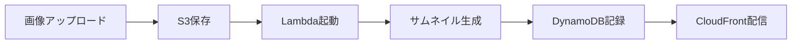

# 📋 ハンズオン資料のDocusaurus実装アプローチ

## 🎯 実装目標
AWS画像処理ハンズオンの資料を、参加者がステップバイステップで進められるインタラクティブなDocusaurusサイトに変換する。

## 📁 現状の資料構成
- `md/handson_complete_guide.md` - 主催者向け完全ガイド（環境構築、事前準備含む）
- `md/participant_handson_manual.md` - 参加者向け実習マニュアル（当日使用）

## 🏗️ 実装方針

### 1. ディレクトリ構造
```
website/docs/
├── intro.md                    # 既存（そのまま残す）
├── handson/                     # 新規作成
│   ├── index.md                # ハンズオン概要
│   ├── 00-preparation.md       # 事前準備・環境確認
│   ├── 01-s3-bucket.md         # Step 1: S3バケット作成
│   ├── 02-dynamodb.md          # Step 2: DynamoDB作成
│   ├── 03-lambda.md            # Step 3: Lambda関数作成
│   ├── 04-s3-event.md          # Step 4: S3イベント設定
│   ├── 05-cloudfront.md        # Step 5: CloudFront設定
│   ├── 06-test.md              # Step 6: システムテスト
│   ├── 07-troubleshooting.md  # トラブルシューティング
│   └── 08-cleanup.md           # 後片付け
├── reference/                   # 新規作成
│   ├── architecture.md         # システム構成図
│   ├── lambda-code.md          # Lambda関数コード
│   └── setup-guide.md          # 主催者向けセットアップ
└── tutorial-basics/            # 既存（そのまま残す）
```

### 2. 各ページの構成要素

#### 共通コンポーネント
- **ヘッダー**: ステップ番号、タイトル、所要時間
- **目標**: このステップで達成すること
- **前提条件**: 前のステップの完了確認
- **手順**: 番号付きの詳細手順
- **確認ポイント**: ✅ チェックリスト形式
- **次のステップへ**: ナビゲーションボタン

#### コード・設定のフォーマット
```markdown
:::tip コピペ用設定
以下の設定をそのままコピーして使用できます：
```yaml
バケット名: あなたのユーザー名-images
リージョン: ap-northeast-1
```
:::
```

### 3. サイドバー設定（sidebars.ts）
```typescript
handsonSidebar: [
  {
    type: 'category',
    label: 'AWS画像処理ハンズオン',
    items: [
      'handson/index',
      'handson/00-preparation',
      {
        type: 'category',
        label: '実習ステップ',
        items: [
          'handson/01-s3-bucket',
          'handson/02-dynamodb',
          'handson/03-lambda',
          'handson/04-s3-event',
          'handson/05-cloudfront',
          'handson/06-test',
        ],
      },
      'handson/07-troubleshooting',
      'handson/08-cleanup',
    ],
  },
  {
    type: 'category',
    label: 'リファレンス',
    items: [
      'reference/architecture',
      'reference/lambda-code',
      'reference/setup-guide',
    ],
  },
],
```

### 4. 進捗管理機能

#### A. Docusaurus標準機能の活用
- サイドバーでの現在位置表示
- ページ下部の「前へ/次へ」ナビゲーション
- 目次（TOC）での進捗確認

#### B. カスタム機能（オプション）
- React コンポーネントで進捗バー実装
- LocalStorageで完了ステップを記録
- チェックリストの状態保存

### 5. ナビゲーション設定（docusaurus.config.ts）
```typescript
navbar: {
  items: [
    {
      type: 'doc',
      docId: 'handson/index',
      position: 'left',
      label: 'ハンズオン',
    },
    // 既存の項目は保持
  ],
},
```

### 6. ビジュアル要素

#### Mermaidダイアグラム使用


#### アイコン・絵文字の活用
- 🎯 目標
- ✅ 完了確認
- ⚠️ 注意事項
- 💡 ヒント
- 🚀 ステップ開始

### 7. 実装順序

1. **Phase 1: 基本構造**（30分）
   - handsonディレクトリ作成
   - 各ステップのmdファイル作成
   - 基本的な内容の移植

2. **Phase 2: ナビゲーション**（20分）
   - sidebars.ts更新
   - docusaurus.config.ts更新
   - ページ間リンク設定

3. **Phase 3: コンテンツ最適化**（30分）
   - コードブロックの整形
   - コピペ用設定の強調
   - チェックリストの追加

4. **Phase 4: ビジュアル強化**（20分）
   - Mermaidダイアグラム追加
   - アラート・ヒントボックス追加
   - 画像・スクリーンショット配置

5. **Phase 5: テスト・調整**（20分）
   - ローカルでの動作確認
   - リンク確認
   - レスポンシブ対応確認

## 📊 期待される成果

### 参加者にとってのメリット
- ステップごとに確実に進められる
- 進捗が視覚的にわかる
- コピペしやすい設定値
- トラブル時の対処法がすぐ見つかる

### 主催者にとってのメリット
- 参加者の進捗を把握しやすい
- 質問対応が効率化
- 資料の更新が容易
- 再利用可能な構成

## 🔄 今後の拡張性
- 動画チュートリアルの埋め込み
- インタラクティブなコード実行環境
- 参加者同士のQ&A機能
- 完了証明書の自動発行

## ✅ 実装前チェックリスト
- [ ] 既存のtutorial-basics等は削除せず保持する
- [ ] 日本語での表示を確認
- [ ] モバイル表示も考慮
- [ ] コピペのしやすさを重視
- [ ] エラー時の対処法を明記