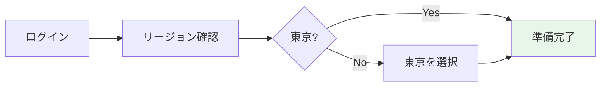

# 🔐 Step 0: 事前準備・環境確認

## ⏱️ このステップの所要時間
**約5分**

## 🎯 このステップのゴール
- AWSマネジメントコンソールにログインできる
- 配布された認証情報を確認する
- 作業環境が整っていることを確認する

---

## 📝 配布資料の確認

まず、配布された資料から以下の情報を確認してください：

:::caution 重要な情報
これらの情報は今後のすべてのステップで使用します。必ずメモを取っておいてください。
:::

### あなたの認証情報

```yaml
ユーザー名: 2025-tohoku-it-[あなたの名前]
例: 2025-tohoku-it-giovanni

Access Key ID: AKIA... （配布資料を確認）
Secret Access Key: ... （配布資料を確認） 
リージョン: ap-northeast-1 （東京）
```

:::tip 🏔️ ユーザー名について
ユーザー名は宮沢賢治の作品や東北ゆかりの名前が付けられています：
- **giovanni**（ジョバンニ）- 『銀河鉄道の夜』の主人公
- **campanella**（カンパネラ）- ジョバンニの親友
- **sansa**（三佐）- 『風の又三郎』より
- **iwatesan**（岩手山）- 東北の名峰
- **matsuo**（松尾）- 松尾芭蕉（奥の細道）
- **rikuchu**（陸中）- 旧国名
- **naoki**（直木）- 作家・直木三十五
- **kenji**（賢治）- 宮沢賢治

東北の文化と物語を大切にしたネーミングです 🌾
:::

---

## 🌐 AWSコンソールへのログイン

### Step 1: ログインページへアクセス

1. ブラウザで以下のURLにアクセス：
   ```
   https://console.aws.amazon.com/
   ```

2. **「IAMユーザー」** を選択


3. サインイン画面


### Step 2: 認証情報の入力

以下の情報を入力してログイン：

| 項目 | 入力内容 |
|------|----------|
| **アカウントID** | 配布資料参照（12桁の数字） |
| **ユーザー名** | `2025-tohoku-it-[あなたの名前]` |
| **パスワード** | 配布資料参照 |

:::warning ⚠️ ログインできない場合
- アカウントIDが正しいか確認
- ユーザー名の前後にスペースが入っていないか確認
- Caps Lockがオンになっていないか確認
- それでもダメな場合は、すぐにスタッフを呼んでください
:::

### Step 3: リージョンの確認と設定

ログイン後、画面右上のリージョンが **「東京」（ap-northeast-1）** になっていることを確認：

1. 画面右上のリージョン名をクリック
2. **「アジアパシフィック（東京）」** を選択



---

## 🔍 環境の確認

### サンプル画像バケットの確認

後のステップで使用するサンプル画像が用意されているか確認します：

1. **「サービス」** → **「S3」** を選択
2. バケット一覧で **`2025-tohoku-it-sample-images`** があることを確認
3. クリックして中身を確認：
   - `samples/` フォルダがある
   - 複数のサンプル画像が格納されている

:::info 📌 サンプル画像について
以下のような画像が用意されています：
- 風景写真（山、海、森など）
- 東北の観光地の写真
- テスト用のシンプルな画像
これらは後のテストで使用します
:::

---

## ✅ 準備完了チェックリスト

以下のすべてにチェックが付いたら、次のステップに進めます：

### 認証情報の確認
- [ ] ユーザー名をメモした
- [ ] Access Key IDをメモした（後のステップで使用）
- [ ] Secret Access Keyをメモした（後のステップで使用）

### AWSコンソール
- [ ] AWSコンソールにログインできた
- [ ] リージョンが「東京」になっている
- [ ] S3サービスにアクセスできる
- [ ] サンプル画像バケットが見える

### 作業環境
- [ ] ブラウザが正常に動作している
- [ ] インターネット接続が安定している
- [ ] メモを取る準備ができている

---

## 🚨 トラブルシューティング

### Q: ログインできません
**A:** 以下を確認してください：
- アカウントIDは12桁の数字です
- ユーザー名は `2025-tohoku-it-` で始まります
- パスワードは大文字小文字を区別します

### Q: S3にアクセスできません
**A:** リージョンが「東京」になっているか確認してください。違う場合は変更してください。

### Q: サンプル画像バケットが見つかりません
**A:** スタッフに連絡してください。環境構築に問題がある可能性があります。

---

## 🎉 準備完了！

:::success おめでとうございます！
環境の準備が整いました。次のステップでは、実際にS3バケットを作成していきます。
:::

<div style={{textAlign: 'center', marginTop: '2rem', fontSize: '1.2em'}}>

[**← 前へ: ハンズオン概要**](./) | [**次へ: Step 1 - S3バケット作成 →**](./01-s3-bucket)

</div>

---

## 📚 参考情報

### IAMユーザーとは？
AWS Identity and Access Management (IAM) のユーザーです。今回のハンズオンでは、参加者ごとに個別のIAMユーザーを用意しています。

### リージョンとは？
AWSのデータセンターがある地理的な場所です。今回は東京リージョン（ap-northeast-1）を使用します。

### なぜ東京リージョン？
- 日本国内からのアクセスが最速
- レイテンシー（遅延）が最小
- 日本の法規制に準拠