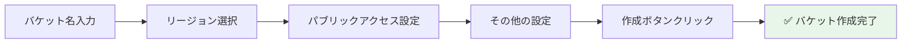

# 🪣 Step 1: S3バケット作成

## ⏱️ このステップの所要時間
**約10分**

## 🎯 このステップのゴール
- 画像保存用のS3バケットを作成する
- バケットの基本設定を理解する
- サンプル画像の確認

---

## 📚 S3とは？

**Amazon Simple Storage Service (S3)** は、AWSのオブジェクトストレージサービスです。

:::info 💡 S3の特徴
- **無制限の容量**: 保存できるデータ量に制限なし
- **高い耐久性**: 99.999999999%（イレブンナイン）の耐久性
- **簡単なアクセス**: HTTPSでどこからでもアクセス可能
- **低コスト**: 使った分だけの従量課金
:::

今回は画像ファイルを保存するために使用します。

---

## 🚀 バケットの作成

### Step 1-1: S3サービスへ移動

1. AWSコンソール上部の **「サービス」** をクリック
2. **「ストレージ」** カテゴリーから **「S3」** を選択
   
   または、検索バーに「S3」と入力して選択

### Step 1-2: バケット作成を開始

1. S3ダッシュボードで **「バケットを作成」** ボタンをクリック

### Step 1-3: バケットの設定

#### 🏷️ バケット名の設定

:::caution ⚠️ バケット名のルール
- **グローバルで一意**である必要があります
- 小文字、数字、ハイフンのみ使用可能
- 3〜63文字の長さ
- IPアドレスの形式は使用不可
:::

**バケット名を入力：**
```
あなたのユーザー名-images
```

**例：**
```
2025-tohoku-it-giovanni-images
```

#### 🌏 リージョンの選択

```yaml
リージョン: アジアパシフィック（東京）ap-northeast-1
```

### Step 1-4: パブリックアクセス設定

:::warning 🔒 セキュリティ重要
今回のハンズオンでは、セキュリティのためパブリックアクセスをブロックします。
後でCloudFront経由でのみアクセス可能にします。
:::

**以下のすべてにチェック ✅：**
- パブリックアクセスをすべてブロック
- 新しいアクセスコントロールリスト (ACL) を介して付与されたバケットとオブジェクトへのパブリックアクセスをブロックする
- 任意のアクセスコントロールリスト (ACL) を介して付与されたバケットとオブジェクトへのパブリックアクセスをブロックする
- 新しいパブリックバケットポリシーまたはアクセスポイントポリシーを介して付与されたバケットとオブジェクトへのパブリックアクセスをブロックする
- 任意のパブリックバケットポリシーまたはアクセスポイントポリシーを介したバケットとオブジェクトへのパブリックアクセスとクロスアカウントアクセスをブロックする

### Step 1-5: その他の設定

以下の設定はデフォルトのままにします：

| 設定項目 | 値 |
|---------|-----|
| **バケットのバージョニング** | 無効 |
| **デフォルト暗号化** | 無効 |
| **オブジェクトロック** | 無効 |

### Step 1-6: バケットの作成

1. ページ下部の **「バケットを作成」** ボタンをクリック
2. 成功メッセージが表示されることを確認



---

## 🔍 作成したバケットの確認

### バケット一覧での確認

1. S3のバケット一覧画面に戻る
2. 作成したバケット名が表示されていることを確認：
   - `2025-tohoku-it-[あなたの名前]-images`

### バケットの詳細確認

1. 作成したバケット名をクリック
2. **「プロパティ」** タブで以下を確認：
   - バケットARN: `arn:aws:s3:::あなたのバケット名`
   - リージョン: アジアパシフィック（東京）

:::tip 📝 ARNとは？
**Amazon Resource Name (ARN)** は、AWSリソースを一意に識別するための文字列です。
後のLambda関数設定で使用します。
:::

---

## 📸 サンプル画像の確認

テストで使用するサンプル画像を確認します：

1. バケット一覧から **`2025-tohoku-it-sample-images`** をクリック
2. **`samples/`** フォルダをクリック
3. 以下のような画像があることを確認：
   - `mountain.jpg` - 山の風景
   - `ocean.jpg` - 海の風景
   - `forest.jpg` - 森の風景
   - その他の画像ファイル

:::info 💡 後で使います
Step 6のテストで、これらの画像をアップロードして処理を確認します。
:::

---

## ✅ 完了確認チェックリスト

以下のすべてが完了していることを確認：

### バケット作成
- [ ] バケット名: `2025-tohoku-it-[あなたの名前]-images` で作成した
- [ ] リージョンが東京（ap-northeast-1）になっている
- [ ] パブリックアクセスがブロックされている

### 確認作業
- [ ] 作成したバケットがS3一覧に表示される
- [ ] バケットをクリックして中身が空であることを確認
- [ ] サンプル画像バケットの中身を確認した

---

## 🚨 トラブルシューティング

### Q: バケット名が使用できないと言われる
**A:** バケット名は世界中で一意である必要があります。以下を試してください：
- 末尾に日付を追加: `2025-tohoku-it-giovanni-images-0109`
- 末尾に番号を追加: `2025-tohoku-it-giovanni-images-001`

### Q: リージョンが選択できない
**A:** 画面右上のリージョン設定が「東京」になっているか確認してください。

### Q: 作成ボタンが押せない
**A:** 必須項目（バケット名、リージョン）が入力されているか確認してください。

---

## 🎊 Step 1 完了！

:::success おめでとうございます！
S3バケットの作成が完了しました。このバケットに画像をアップロードすると、自動的にサムネイルが生成されるシステムを構築していきます。
:::

### 📝 このステップで学んだこと
- ✅ S3バケットの作成方法
- ✅ バケット名の命名規則
- ✅ セキュリティ設定（パブリックアクセスブロック）
- ✅ リージョンの重要性

<div style={{textAlign: 'center', marginTop: '2rem', fontSize: '1.2em'}}>

[**← 前へ: Step 0 - 事前準備**](./00-preparation) | [**次へ: Step 2 - DynamoDB作成 →**](./02-dynamodb)

</div>

---

## 📚 参考：S3の料金について

:::info 💰 S3の料金体系
- **ストレージ料金**: 約$0.025/GB/月（東京リージョン）
- **リクエスト料金**: PUT/GET等のリクエスト数に応じて課金
- **データ転送料金**: インターネットへの転送は有料

今回のハンズオンでは、ごく少量のデータしか扱わないため、料金はほぼ発生しません。
:::

## 🔗 次のステップの準備

次のStep 2では、画像のメタデータを保存するDynamoDBテーブルを作成します。
- 画像ID
- アップロード日時
- ファイルサイズ
- サムネイルのURL

などの情報を管理できるようにします。