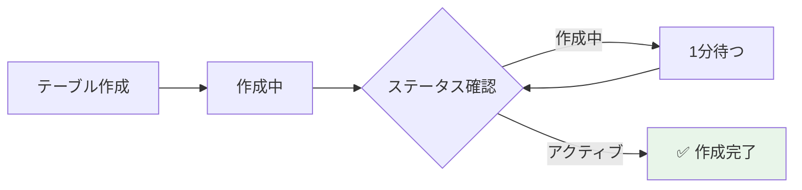

# 📊 Step 2: DynamoDBテーブル作成

## ⏱️ このステップの所要時間
**約10分**

## 🎯 このステップのゴール
- 画像のメタデータを保存するDynamoDBテーブルを作成する
- NoSQLデータベースの基本を理解する
- グローバルセカンダリインデックス（GSI）を設定する

---

## 📚 DynamoDBとは？

**Amazon DynamoDB** は、AWSが提供するフルマネージドのNoSQLデータベースサービスです。

:::info 💡 DynamoDBの特徴
- **高速**: ミリ秒単位のレスポンス時間
- **スケーラブル**: 自動的にスケールアップ/ダウン
- **フルマネージド**: サーバー管理不要
- **高可用性**: 3つのAZに自動レプリケーション
:::

### 🏗️ 保存するデータ構造の設計

今回のDynamoDBテーブルでは以下の構造でメタデータを保存します：

```json
{
  "image_id": "uuid-generated-id",           // パーティションキー
  "upload_time": "2025-01-15T10:30:45.123Z", // GSI用
  "original_image": {
    "key": "photos/landscape.jpg",
    "width": 1920,
    "height": 1080, 
    "file_size": 234567,
    "format": "JPEG"
  },
  "processed_images": [
    {
      "key": "thumbnails/small/landscape_thumb.jpg",
      "size": "small",
      "width": 150,
      "height": 84,
      "file_size": 8192,
      "format": "JPEG"
    },
    {
      "key": "thumbnails/medium/landscape_thumb.jpg", 
      "size": "medium",
      "width": 300,
      "height": 168,
      "file_size": 18432,
      "format": "JPEG"
    },
    {
      "key": "thumbnails/large/landscape_thumb.jpg",
      "size": "large", 
      "width": 600,
      "height": 337,
      "file_size": 45123,
      "format": "JPEG"
    }
  ]
}
```

### 🔑 キー設計の技術的理由

#### パーティションキー: `image_id`
- **目的**: 各画像レコードの一意識別
- **データ型**: String（UUIDv4形式）
- **検索**: 特定画像の情報を高速取得

#### GSI: `upload_time-index` 
- **目的**: 時系列での画像検索
- **用途**: 最新画像の表示、日付範囲検索
- **Query効率**: アップロード順での効率的な検索

---

## 🚀 テーブルの作成

### Step 2-1: DynamoDBサービスへ移動

1. 検索バーに「DynamoDB」と入力して選択

### Step 2-2: テーブル作成を開始

1. DynamoDBダッシュボードで **「テーブルの作成」** ボタンをクリック


:::tip 💡 画像について
この画像は現在プレースホルダーです。実際のAWSコンソール画面に後日置き換え予定です。
:::

### Step 2-3: テーブルの設定

#### 📝 基本設定

:::caution ⚠️ テーブル名の重要性
テーブル名は後のLambda関数で使用します。正確に入力してください。
:::

**以下の設定をコピー＆ペースト：**

```yaml
テーブル名: 2025-tohoku-it-あなたのユーザー名-image-metadata
例: 2025-tohoku-it-giovanni-image-metadata

パーティションキー: image_id
データ型: 文字列（String）
```

#### ⚙️ テーブル設定

1. デフォルト設定が選択されている状態を確認

| 設定項目 | 選択値 |
|---------|--------|
| **テーブルクラス** | DynamoDB Standard |
| **キャパシティモード** | オンデマンド |

:::tip 💡 オンデマンドモードとは？
使用した分だけ課金される設定です。事前にキャパシティを予約する必要がなく、自動的にスケールします。
ハンズオンには最適な設定です。
:::

#### 🔒 暗号化設定

```yaml
暗号化の管理: DynamoDBが所有するキー
```

### Step 2-4: テーブルの作成実行

1. その他の設定はデフォルトのまま
2. ページ下部の **「テーブルの作成」** ボタンをクリック
3. 成功メッセージが表示されることを確認

---

## 🔍 作成したテーブルの確認

### テーブル一覧での確認

1. DynamoDBのテーブル一覧画面に戻る
2. 作成したテーブル名が表示されていることを確認
3. ステータスが **「作成中」** → **「アクティブ」** に変わるまで待つ（約1-2分）



### テーブルの詳細確認

1. 作成したテーブル名をクリック
2. **「概要」** タブで以下を確認：
   - テーブルARN: `arn:aws:dynamodb:ap-northeast-1:...`
   - パーティションキー: `image_id (String)`
   - 項目数: 0

---

## 📈 グローバルセカンダリインデックス（GSI）の追加

GSIを追加することで、パーティションキー以外の属性でも高速検索が可能になります。

### Step 2-5: インデックスタブへ移動

1. 作成したテーブルの詳細画面で **「インデックス」** タブをクリック
2. **「インデックスの作成」** ボタンをクリック

### Step 2-6: GSIの設定

**以下の設定をコピー＆ペースト：**

```yaml
パーティションキー: upload_time
データ型: 文字列（String）
インデックス名: upload-time-index(自動的に入力される)
インデックスキャパシティー : そのまま
ウォームスループット: そのまま
投影される属性: すべて
```

:::info 📝 GSIの用途
このインデックスにより、アップロード日時での検索や並び替えが高速に行えるようになります。
例：「今日アップロードされた画像一覧」を取得
:::

### Step 2-7: インデックスの作成実行

1. **「インデックスの作成」** ボタンをクリック
2. インデックスのステータスが **「作成中」** → **「アクティブ」** に変わるまで待つ（約2-3分）

---

## 📝 保存されるデータの例

このテーブルには、以下のような形式でデータが保存されます：

```json
{
  "image_id": "550e8400-e29b-41d4-a716-446655440000",
  "upload_time": "2025-01-09T10:30:00Z",
  "original_url": "https://s3.ap-northeast-1.amazonaws.com/bucket/original/image.jpg",
  "file_size": 2048576,
  "thumbnails": {
    "small": "https://s3.ap-northeast-1.amazonaws.com/bucket/thumbnails/150px/image.jpg",
    "medium": "https://s3.ap-northeast-1.amazonaws.com/bucket/thumbnails/300px/image.jpg",
    "large": "https://s3.ap-northeast-1.amazonaws.com/bucket/thumbnails/600px/image.jpg"
  },
  "content_type": "image/jpeg",
  "created_at": "2025-01-09T10:30:00Z"
}
```

---

## ✅ 完了確認チェックリスト

以下のすべてが完了していることを確認：

### テーブル作成
- [ ] テーブル名: `2025-tohoku-it-[あなたの名前]-image-metadata` で作成した
- [ ] パーティションキー: `image_id (String)` を設定した
- [ ] キャパシティモード: オンデマンドを選択した
- [ ] テーブルのステータスが「アクティブ」になった

### インデックス作成
- [ ] GSI名: `upload-time-index` を作成した
- [ ] パーティションキー: `upload_time (String)` を設定した
- [ ] インデックスのステータスが「アクティブ」になった

### 確認作業
- [ ] テーブル一覧に作成したテーブルが表示される
- [ ] 項目数が0であることを確認した
- [ ] テーブルARNをメモした（後で使用）

---

## 🚨 トラブルシューティング

### Q: テーブル作成ボタンが押せない
**A:** 必須項目（テーブル名、パーティションキー）が入力されているか確認してください。

### Q: ステータスが「アクティブ」にならない
**A:** 通常1-2分で完了します。5分以上経っても変わらない場合は、ページを更新してみてください。

### Q: インデックス作成でエラーが出る
**A:** テーブルがまだ「作成中」の可能性があります。テーブルが「アクティブ」になってから再度試してください。

### Q: 項目数が0でない
**A:** 問題ありません。テスト用のデータが入っている可能性がありますが、動作に影響はありません。

---

## 🎊 Step 2 完了！

:::success おめでとうございます！
DynamoDBテーブルの作成が完了しました。このテーブルに、Lambda関数が画像処理の結果を自動的に記録します。
:::

### 📝 このステップで学んだこと
- ✅ DynamoDBテーブルの作成方法
- ✅ パーティションキーの設定
- ✅ オンデマンドモードの利点
- ✅ グローバルセカンダリインデックス（GSI）の作成

<div style={{textAlign: 'center', marginTop: '2rem', fontSize: '1.2em'}}>

[**← 前へ: Step 1 - S3バケット作成**](./s3-bucket) | [**次へ: Step 3 - IAMロール作成 →**](./lambda)

</div>

---

## 📚 参考：DynamoDBの料金について

:::info 💰 DynamoDBの料金体系（オンデマンド）
- **書き込み**: $1.25 per million write request units
- **読み取り**: $0.25 per million read request units
- **ストレージ**: $0.25 per GB-month
- **GSI**: 基本テーブルと同じ料金体系

今回のハンズオンでは、ごく少量のデータしか扱わないため、料金はほぼ発生しません。
:::

## 🔗 次のステップの準備

次のStep 3では、画像を自動処理するLambda関数を作成します。
この関数は：
- S3から画像を取得
- 3つのサイズのサムネイルを生成
- DynamoDBにメタデータを保存
- CloudFront用のヘッダーを設定

という一連の処理を自動で行います。