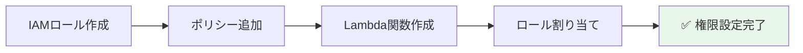

# ⚡ Step 3: Lambda関数作成

## ⏱️ このステップの所要時間
**約15分**

## 🎯 このステップのゴール
- 画像処理を行うLambda関数を作成する
- IAMロールで適切な権限を設定する
- 環境変数とタイムアウトを設定する

---

## 📚 AWS Lambdaとは？

**AWS Lambda** は、サーバーを管理せずにコードを実行できるサーバーレスコンピューティングサービスです。

:::info 💡 Lambdaの特徴
- **サーバーレス**: インフラ管理不要
- **自動スケーリング**: リクエストに応じて自動拡張
- **料金効率**: 実行時間分だけ課金（ミリ秒単位）
- **イベント駆動**: S3、DynamoDB等のイベントで自動実行
:::

今回のLambda関数は以下の処理を行います：
1. S3に画像がアップロードされたら自動起動
2. 画像を3つのサイズ（150px, 300px, 600px）にリサイズ
3. サムネイルをS3に保存
4. メタデータをDynamoDBに記録

---

## 🔐 Step 3-1: IAMロール作成

Lambda関数がS3とDynamoDBにアクセスするための権限を設定します。

### IAMサービスへ移動

1. **「サービス」** → **「セキュリティ、アイデンティティ、コンプライアンス」** → **「IAM」** を選択
2. 左メニューから **「ロール」** を選択
3. **「ロールを作成」** ボタンをクリック

### 基本設定

**信頼されたエンティティの選択：**
```yaml
信頼されたエンティティタイプ: AWSのサービス
使用事例: Lambda
```

**「次へ」** をクリック

### 基本ポリシーの追加

検索ボックスで以下を検索し、チェックを入れる：
```
AWSLambdaBasicExecutionRole
```

:::tip 💡 このポリシーの役割
CloudWatch Logsへのログ書き込み権限を提供します。Lambda関数の実行ログを確認するために必要です。
:::

---

## 📝 Step 3-2: カスタムポリシー作成

### S3アクセス用ポリシー

1. **「ポリシーを作成」** をクリック（新しいタブが開く）
2. **「JSON」** タブを選択
3. 以下のJSONをコピー＆ペースト：

```json
{
    "Version": "2012-10-17",
    "Statement": [
        {
            "Effect": "Allow",
            "Action": [
                "s3:GetObject",
                "s3:PutObject",
                "s3:DeleteObject"
            ],
            "Resource": "arn:aws:s3:::あなたのユーザー名-images/*"
        },
        {
            "Effect": "Allow",
            "Action": [
                "s3:ListBucket"
            ],
            "Resource": "arn:aws:s3:::あなたのユーザー名-images"
        }
    ]
}
```

:::caution ⚠️ 重要
`あなたのユーザー名-images` を実際のバケット名に置き換えてください。
例: `2025-tohoku-it-giovanni-images`
:::

4. **「次へ」** をクリック
5. ポリシー名: `あなたのユーザー名-S3-Access`
6. **「ポリシーの作成」** をクリック

### DynamoDBアクセス用ポリシー

同様の手順で、DynamoDB用のポリシーも作成：

```json
{
    "Version": "2012-10-17",
    "Statement": [
        {
            "Effect": "Allow",
            "Action": [
                "dynamodb:PutItem",
                "dynamodb:GetItem",
                "dynamodb:UpdateItem",
                "dynamodb:DeleteItem",
                "dynamodb:Query",
                "dynamodb:Scan"
            ],
            "Resource": "arn:aws:dynamodb:ap-northeast-1:*:table/あなたのユーザー名-image-metadata"
        }
    ]
}
```

ポリシー名: `あなたのユーザー名-DynamoDB-Access`

---

## 🎭 Step 3-3: ロール作成完了

1. 元のタブ（ロール作成画面）に戻る
2. ページを **更新** する
3. 作成した2つのカスタムポリシーを検索して選択：
   - `あなたのユーザー名-S3-Access`
   - `あなたのユーザー名-DynamoDB-Access`
4. 合計**3つのポリシー**が選択されていることを確認

**「次へ」** をクリック

### ロール名の設定

```yaml
ロール名: あなたのユーザー名-lambda-role
例: 2025-tohoku-it-giovanni-lambda-role

説明: Lambda role for image processing handson
```

**「ロールを作成」** をクリック

---

## ⚡ Step 3-4: Lambda関数の作成

### Lambdaサービスへ移動

1. **「サービス」** → **「コンピューティング」** → **「Lambda」** を選択
2. **「関数の作成」** ボタンをクリック

### 基本設定

```yaml
作成方法: 一から作成
関数名: あなたのユーザー名-image-processor
例: 2025-tohoku-it-giovanni-image-processor

ランタイム: Python 3.9
アーキテクチャ: x86_64
```

:::info 📝 ランタイムについて
Python 3.9を使用します。安定性が高く、画像処理ライブラリ（Pillow）との互換性も良好です。
:::

### 実行ロールの設定

```yaml
実行ロール: 既存のロールを使用する
既存のロール: あなたのユーザー名-lambda-role
```

**「関数の作成」** をクリック



---

## 📦 Step 3-5: 関数コードのアップロード

### コードのアップロード

1. Lambda関数の詳細画面で **「コード」** タブを確認
2. **「アップロード元」** → **「.zipファイル」** を選択
3. 講師から配布された **`lambda-image-processor.zip`** をアップロード
4. **「保存」** をクリック

:::tip 💡 zipファイルの内容
- `lambda_function.py`: メイン処理
- `PIL/`: 画像処理ライブラリ（Pillow）
- サムネイル生成とDynamoDB連携のコード
:::

---

## ⚙️ Step 3-6: 環境変数の設定

1. **「設定」** タブをクリック
2. **「環境変数」** を選択
3. **「編集」** ボタンをクリック
4. **「環境変数を追加」** をクリック

```yaml
キー: TABLE_NAME
値: あなたのユーザー名-image-metadata
例: 2025-tohoku-it-giovanni-image-metadata
```

**「保存」** をクリック

---

## ⏱️ Step 3-7: タイムアウトとメモリ設定

1. **「設定」** → **「一般設定」** を選択
2. **「編集」** ボタンをクリック

```yaml
メモリ: 512 MB
タイムアウト: 5分 0秒
説明: Image processing function for handson
```

:::warning ⚠️ タイムアウトの重要性
大きな画像の処理には時間がかかる場合があります。デフォルトの3秒では不足するため、5分に設定します。
:::

**「保存」** をクリック

---

## ✅ 完了確認チェックリスト

以下のすべてが完了していることを確認：

### IAMロール
- [ ] ロール名: `2025-tohoku-it-[あなたの名前]-lambda-role` を作成した
- [ ] S3アクセス用ポリシーを作成・追加した
- [ ] DynamoDBアクセス用ポリシーを作成・追加した
- [ ] AWSLambdaBasicExecutionRoleを追加した

### Lambda関数
- [ ] 関数名: `2025-tohoku-it-[あなたの名前]-image-processor` を作成した
- [ ] Python 3.9ランタイムを選択した
- [ ] IAMロールを正しく設定した
- [ ] zipファイルをアップロードした

### 設定
- [ ] 環境変数 `TABLE_NAME` を設定した
- [ ] タイムアウトを5分に設定した
- [ ] メモリを512MBに設定した

---

## 🚨 トラブルシューティング

### Q: ロールが選択できない
**A:** IAMロール作成後、Lambda画面を更新してください。それでも表示されない場合は、ロール名を確認してください。

### Q: zipファイルのアップロードでエラーが出る
**A:** ファイルサイズが大きすぎる可能性があります。配布されたファイルを使用しているか確認してください。

### Q: 環境変数の保存でエラーが出る
**A:** キー名に誤字がないか確認してください。`TABLE_NAME`（すべて大文字）である必要があります。

### Q: タイムアウト設定が保存されない
**A:** 最大値は15分です。5分以下の値を設定してください。

---

## 🎊 Step 3 完了！

:::success おめでとうございます！
Lambda関数の作成が完了しました。次のステップでS3からのトリガーを設定すると、画像が自動処理されるようになります。
:::

### 📝 このステップで学んだこと
- ✅ IAMロールとポリシーの作成方法
- ✅ Lambda関数の作成と設定
- ✅ 環境変数の使用方法
- ✅ タイムアウトとメモリの適切な設定

<div style={{textAlign: 'center', marginTop: '2rem', fontSize: '1.2em'}}>

[**← 前へ: Step 2 - DynamoDB作成**](./dynamodb) | [**次へ: Step 4 - S3イベント設定 →**](./s3-event)

</div>

---

## 📚 参考：Lambda関数のコード概要

作成したLambda関数は以下の処理を行います：

```python
# 疑似コード（実際のコードの概要）
def lambda_handler(event, context):
    # 1. S3イベントから画像情報を取得
    bucket = event['Records'][0]['s3']['bucket']['name']
    key = event['Records'][0]['s3']['object']['key']
    
    # 2. 画像をダウンロード
    image = download_from_s3(bucket, key)
    
    # 3. 3つのサイズでサムネイル作成
    thumbnails = {
        'small': resize_image(image, 150),
        'medium': resize_image(image, 300),
        'large': resize_image(image, 600)
    }
    
    # 4. サムネイルをS3にアップロード
    for size, thumb in thumbnails.items():
        upload_to_s3(thumb, f"thumbnails/{size}/{key}")
    
    # 5. メタデータをDynamoDBに保存
    save_to_dynamodb({
        'image_id': generate_uuid(),
        'upload_time': datetime.now(),
        'original_url': f"s3://{bucket}/{key}",
        'thumbnails': thumbnail_urls
    })
```

## 🔗 次のステップの準備

次のStep 4では、S3バケットにイベントトリガーを設定します。
これにより、画像がアップロードされた瞬間に自動的にLambda関数が実行されるようになります。