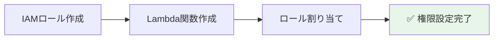

# ⚡ Step 4: Lambda関数作成

## ⏱️ このステップの所要時間
**約15分**

## 🎯 このステップのゴール
- 画像処理を行うLambda関数を作成する
- Python 3.13コードを実装する
- 環境変数とタイムアウトを設定する

---

## 📚 AWS Lambdaとは？

**AWS Lambda** は、サーバーを管理せずにコードを実行できるサーバーレスコンピューティングサービスです。

:::info 💡 Lambdaの特徴
- **サーバーレス**: インフラ管理不要
- **自動スケーリング**: リクエストに応じて自動拡張
- **料金効率**: 実行時間分だけ課金（ミリ秒単位）
- **イベント駆動**: S3、DynamoDB等のイベントで自動実行
:::

今回のLambda関数は以下の処理を行います：
1. **S3イベントトリガー**: 画像がアップロードされたら自動起動
2. **画像処理**: 3つのサイズ（150px, 300px, 600px）にリサイズ
3. **S3保存**: 生成したサムネイルを効率的にアップロード
4. **メタデータ記録**: 処理結果をDynamoDBに構造化して保存

---

## ⚡ Step 4-1: Lambda関数の作成

### Lambdaサービスへ移動

1. **「サービス」** → **「コンピューティング」** → **「Lambda」** を選択
2. **「関数の作成」** ボタンをクリック

### 基本設定

```yaml
作成方法: 一から作成
関数名: 2025-tohoku-itあなたのユーザー名-image-processor
例: 2025-tohoku-it-giovanni-image-processor

ランタイム: Python 3.12
アーキテクチャ: x86_64
```

:::info 📝 安定した環境を使用
Python 3.12とx86_64アーキテクチャの組み合わせで、Pillowライブラリとの互換性を確保した安定した実行環境を実現します。
:::

### 実行ロールの設定

```yaml
実行ロール: 既存のロールを使用する
既存のロール: 2025-tohoku-it-あなたのユーザー名-lambda-role
```

**「関数の作成」** をクリック



---

## 📦 Step 4-2: 関数コードの実装

### コードエディタでの直接入力

1. Lambda関数の詳細画面で **「コード」** タブを選択
2. エディタに以下のコードをコピー＆ペースト：

```python
import json
import boto3
import os
from datetime import datetime
from urllib.parse import unquote_plus
import uuid
from PIL import Image
import io

# AWSサービスのクライアント初期化
s3 = boto3.client('s3')
dynamodb = boto3.resource('dynamodb')
table = dynamodb.Table(os.environ['TABLE_NAME'])

def lambda_handler(event, context):
    """
    S3にアップロードされた画像を処理するメイン関数
    1. 画像をダウンロード
    2. 3つのサイズでサムネイル作成
    3. サムネイルをS3に保存
    4. メタデータをDynamoDBに記録
    """
    try:
        # S3イベントから情報を取得
        record = event['Records'][0]
        bucket = record['s3']['bucket']['name']
        key = unquote_plus(record['s3']['object']['key'])
        
        print(f"処理開始: {bucket}/{key}")
        
        # オリジナル画像をS3からダウンロード
        response = s3.get_object(Bucket=bucket, Key=key)
        image_content = response['Body'].read()
        content_type = response.get('ContentType', 'image/jpeg')
        
        # PILで画像を開く
        image = Image.open(io.BytesIO(image_content))
        original_format = image.format or 'JPEG'
        
        # RGBA形式の場合はRGBに変換（JPEG保存用）
        if image.mode in ('RGBA', 'LA', 'P'):
            # 白背景を作成
            rgb_image = Image.new('RGB', image.size, (255, 255, 255))
            # アルファチャンネルがある場合は合成
            if image.mode == 'RGBA' or image.mode == 'LA':
                rgb_image.paste(image, mask=image.split()[-1])
            else:
                rgb_image.paste(image)
            image = rgb_image
        
        # サムネイルサイズの定義
        thumbnail_sizes = {
            'small': 150,
            'medium': 300,
            'large': 600
        }
        
        # 生成したサムネイル情報を格納
        processed_images = []
        
        # 各サイズのサムネイルを生成
        for size_name, size_px in thumbnail_sizes.items():
            print(f"サムネイル生成中: {size_name} ({size_px}px)")
            
            # サムネイル作成（アスペクト比を維持）
            thumbnail = image.copy()
            thumbnail.thumbnail((size_px, size_px), Image.Resampling.LANCZOS)
            
            # メモリ上でJPEGとして保存
            output_buffer = io.BytesIO()
            thumbnail.save(output_buffer, format='JPEG', quality=85, optimize=True)
            thumbnail_data = output_buffer.getvalue()
            output_buffer.seek(0)
            
            # S3にアップロード用のキーを生成
            # 元のファイル名から拡張子を除去してサムネイル用に変更
            base_name = key.rsplit('.', 1)[0] if '.' in key else key
            thumbnail_key = f"thumbnails/{size_name}/{base_name}_thumb.jpg"
            
            s3.put_object(
                Bucket=bucket,
                Key=thumbnail_key,
                Body=thumbnail_data,
                ContentType='image/jpeg'
            )
            
            # DynamoDB用のサムネイル情報を記録
            processed_images.append({
                "key": thumbnail_key,
                "size": size_name,
                "width": thumbnail.width,
                "height": thumbnail.height,
                "file_size": len(thumbnail_data),
                "format": "JPEG"
            })
            
            print(f"✓ {size_name}サムネイル保存完了: {thumbnail_key}")
        
        # DynamoDBにメタデータを保存（設計書の構造に合わせる）
        image_id = str(uuid.uuid4())
        current_time = datetime.now().strftime("%Y-%m-%dT%H:%M:%S.%fZ")
        
        item = {
            'image_id': image_id,
            'upload_time': current_time,
            'original_image': {
                'key': key,
                'width': image.width,
                'height': image.height,
                'file_size': len(image_content),
                'format': original_format
            },
            'processed_images': processed_images
        }
        
        table.put_item(Item=item)
        print(f"✓ DynamoDBへの保存完了: {image_id}")
        
        # 成功レスポンス
        return {
            'statusCode': 200,
            'body': json.dumps({
                'message': '画像処理が正常に完了しました',
                'image_id': image_id,
                'original_key': key,
                'thumbnails_created': len(processed_images)
            }, ensure_ascii=False)
        }
        
    except Exception as e:
        print(f"エラー発生: {str(e)}")
        import traceback
        traceback.print_exc()
        
        # エラー情報をDynamoDBに記録
        try:
            error_item = {
                'image_id': str(uuid.uuid4()),
                'upload_time': datetime.now().strftime("%Y-%m-%dT%H:%M:%S.%fZ"),
                'original_image': {
                    'key': key if 'key' in locals() else 'unknown',
                    'width': 0,
                    'height': 0,
                    'file_size': 0,
                    'format': 'UNKNOWN'
                },
                'processed_images': [],
                'error_message': str(e)
            }
            table.put_item(Item=error_item)
        except Exception as db_error:
            print(f"DynamoDBエラー記録も失敗: {str(db_error)}")
        
        # エラーレスポンス
        return {
            'statusCode': 500,
            'body': json.dumps({
                'error': '画像処理中にエラーが発生しました',
                'details': str(e)
            }, ensure_ascii=False)
        }
```

3. **「Deploy」** ボタンをクリックして保存

:::tip 💡 コードの特徴
- **Python 3.12対応**: 安定したランタイムで確実な動作を実現
- **設計書との整合性**: DynamoDBの`original_image`と`processed_images`構造に完全対応
- **エラーハンドリング**: 処理失敗時もDynamoDBに記録（構造を統一）
- **画像形式対応**: PNG、JPEG、GIFなど多様な形式に対応
- **アスペクト比維持**: 画像の縦横比を保ったままリサイズ
- **最適化**: JPEG品質85%で容量と画質のバランスを確保
- **デバッグ強化**: トレースバック出力でエラー原因を特定しやすく
:::

---

## 📚 Step 4-3: Lambdaレイヤーの追加（Pillowライブラリ）

画像処理に必要なPillowライブラリを追加します。

1. **Lambda関数のページ** で **「コード」** タブを開く
2. 下部の **「レイヤー」** セクションで **「レイヤーの追加」** をクリック
3. **「ARNを指定」** を選択
4. 以下のARNを入力：

```
arn:aws:lambda:ap-northeast-1:770693421928:layer:Klayers-p312-pillow:2
```

5. **「追加」** をクリック

:::warning ⚠️ 重要
このレイヤーはx86_64アーキテクチャ専用です。arm64では動作しません。
:::

---

## ⚙️ Step 4-4: 環境変数の設定

1. **「設定」** タブをクリック
2. **「環境変数」** を選択
3. **「編集」** ボタンをクリック
4. **「環境変数を追加」** をクリック

```yaml
キー: TABLE_NAME
値: 2025-tohoku-it-あなたのユーザー名-image-metadata
例: 2025-tohoku-it-giovanni-image-metadata
```

**「保存」** をクリック

---

## ⏱️ Step 4-5: タイムアウトとメモリ設定

1. **「設定」** → **「一般設定」** を選択
2. **「編集」** ボタンをクリック

```yaml
メモリ: 512 MB
タイムアウト: 5分 0秒
説明: Image processing function for handson
```

:::warning ⚠️ タイムアウトの重要性
大きな画像の処理には時間がかかる場合があります。デフォルトの3秒では不足するため、5分に設定します。
:::

**「保存」** をクリック

---

## ✅ 完了確認チェックリスト

以下のすべてが完了していることを確認：

### Lambda関数作成
- [ ] 関数名: `2025-tohoku-it-[あなたの名前]-image-processor` を作成した
- [ ] Python 3.12ランタイムを選択した
- [ ] x86_64アーキテクチャを選択した
- [ ] Step 3で作成したIAMロールを設定した
- [ ] コードをコピー＆ペーストして保存した

### 設定
- [ ] Pillowレイヤーを追加した
- [ ] 環境変数 `TABLE_NAME` を設定した
- [ ] タイムアウトを5分に設定した
- [ ] メモリを512MBに設定した

---

## 🚨 トラブルシューティング

### Q: ロールが選択できない
**A:** IAMロール作成後、Lambda画面を更新してください。それでも表示されない場合は、Step 3でロール名を確認してください。

### Q: コードの貼り付けでエラーが出る
**A:** インデントが崩れている可能性があります。エディタ全体を選択してから貼り付け直してください。

### Q: レイヤーの追加でエラーが出る
**A:** ARNが正しくコピーされているか、リージョンがap-northeast-1（東京）であることを確認してください。

### Q: 環境変数の保存でエラーが出る
**A:** キー名に誤字がないか確認してください。`TABLE_NAME`（すべて大文字）である必要があります。

### Q: タイムアウト設定が保存されない
**A:** 最大値は15分です。5分以下の値を設定してください。

---

## 🎊 Step 4 完了！

:::success おめでとうございます！
Lambda関数の作成が完了しました。次のステップでS3からのトリガーを設定すると、画像が自動処理されるようになります。
:::

### 📝 このステップで学んだこと
- ✅ Lambda関数の作成と設定
- ✅ Python 3.12コードの実装
- ✅ Lambdaレイヤーの使用方法
- ✅ 環境変数の使用方法
- ✅ タイムアウトとメモリの適切な設定

<div style={{textAlign: 'center', marginTop: '2rem', fontSize: '1.2em'}}>

[**← 前へ: Step 3 - IAMロール作成**](./lambda) | [**次へ: Step 5 - S3イベント設定 →**](./s3-event)

</div>

---

## 🛠️ コードトラブル時の復旧方法

Lambda関数のコードに問題が発生した場合の対処法をまとめています。

### パターン1: Lambda関数エディタでの直接修正

#### 軽微な修正の場合
1. **Lambda関数のページに移動**
   - Lambda関数一覧から作成した関数をクリック
   - **「コード」** タブを選択

2. **エディタで直接編集**
   - `lambda_function.py` ファイルをクリック
   - 修正が必要な部分を編集
   - **「Deploy」** ボタンをクリックして保存

3. **テスト実行**
   - **「Test」** ボタンをクリック
   - テストイベントを作成して動作確認

#### よくある修正例
```python
# 環境変数の参照間違い
table_name = os.environ['TABLE_NAME']  # 正しい

# インデント間違い
def process_image(image_data):
    # 4スペースでインデント
    return processed_image
```

### パターン2: コード全体の再入力

#### 大規模な修正が必要な場合

1. **Lambda関数のコードタブを開く**
   - Lambda関数一覧から作成した関数をクリック
   - **「コード」** タブを選択

2. **コード全体を選択して削除**
   - エディタ内で `Ctrl+A` (Windows) または `Cmd+A` (Mac) で全選択
   - Deleteキーで削除

3. **正しいコードを貼り付け**
   - 上記Step 4-2のコードをコピー
   - エディタに貼り付け
   - **「Deploy」** ボタンをクリック

4. **動作確認**
   - **「Test」** ボタンでテスト実行
   - CloudWatch Logsでエラーを確認

### パターン3: 設定関連の確認・修正

#### 環境変数の確認
```yaml
TABLE_NAME: あなたのユーザー名-image-metadata
例: 2025-tohoku-it-giovanni-image-metadata
```

1. Lambda関数の **「設定」** → **「環境変数」**
2. `TABLE_NAME` の値が正しいDynamoDBテーブル名と一致するか確認
3. 間違っている場合は **「編集」** で修正

#### IAMロールの確認
1. Lambda関数の **「設定」** → **「アクセス権限」**
2. **実行ロール**で使用しているロール名を確認
3. IAMコンソールでロールの権限を確認

#### タイムアウト・メモリ設定の確認
```yaml
必須設定:
タイムアウト: 5分（300秒）
メモリ: 512 MB
アーキテクチャ: x86_64
ランタイム: Python 3.12
```

### 緊急時復旧チェックリスト

コードトラブル発生時は以下を順番に確認：

- [ ] **CloudWatch Logs**でエラー内容を確認
  - Lambda関数名のロググループを参照
  - エラーメッセージから原因を特定

- [ ] **環境変数**の設定値を確認
  - `TABLE_NAME` がDynamoDBテーブル名と一致
  - スペルミス、余分な文字がないか

- [ ] **IAMロール**の権限を確認
  - S3読み取り・書き込み権限
  - DynamoDB操作権限
  - CloudWatch Logs出力権限

- [ ] **関数設定**を確認
  - タイムアウト: 300秒（5分）
  - メモリ: 512MB以上
  - ランタイム: Python 3.13
  - アーキテクチャ: arm64

- [ ] **テストイベント**での動作確認
  - 簡単なS3イベントでテスト
  - エラーログを確認

:::warning 🚨 重要な注意点
- コードを修正する前に、**必ず元のコードをバックアップ**してください
- 修正後は**必ずテスト**を実行してから本番利用してください  
- わからない場合は**スタッフに相談**してください
:::

---

## 🔗 次のステップの準備

次のStep 5では、S3バケットにイベントトリガーを設定します。
これにより、画像がアップロードされた瞬間に自動的にLambda関数が実行されるようになります。