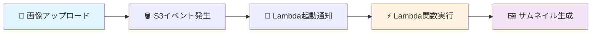
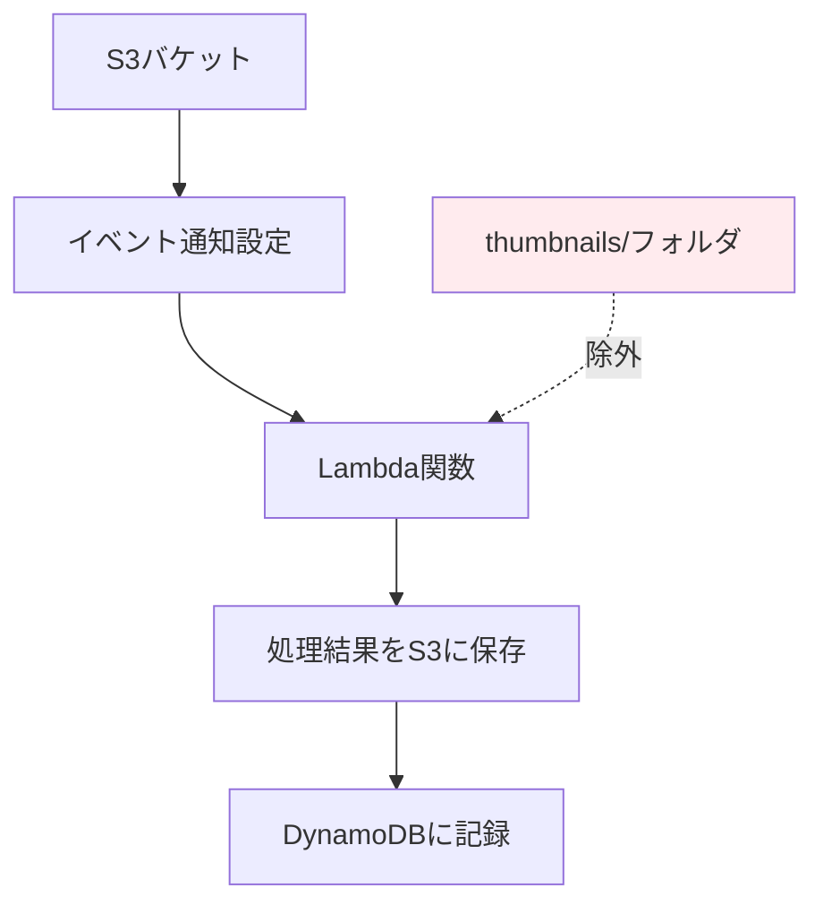

# 🔗 Step 5: S3イベント設定

## ⏱️ このステップの所要時間
**約10分**

## 🎯 このステップのゴール
- S3バケットからLambda関数を自動実行するトリガーを設定する
- イベント駆動アーキテクチャの仕組みを理解する
- 無限ループを防ぐフィルター設定を行う

---

## 📚 S3イベント通知とは？

**S3イベント通知** は、S3バケット内でオブジェクトの作成、削除、更新が発生した際に、自動的に他のAWSサービスに通知する機能です。

:::info 💡 イベント駆動の利点
- **リアルタイム処理**: ファイルアップロード直後に処理開始
- **自動化**: 手動操作不要で一連の処理を実行
- **スケーラブル**: 同時に複数のファイル処理が可能
- **効率的**: 必要な時のみLambda関数が実行される
:::

今回の設定では、画像がアップロードされた瞬間にLambda関数が起動し、自動的にサムネイルを生成します。



---

## 🚀 Step 4-1: Lambdaトリガーの追加

### Lambda関数へ移動

1. **「サービス」** → **「Lambda」** を選択
2. 前のステップで作成した関数 **`あなたのユーザー名-image-processor`** をクリック

### トリガータブへ移動

1. Lambda関数の詳細画面で **「設定」** タブをクリック
2. 左側のメニューから **「トリガー」** を選択
3. **「トリガーを追加」** ボタンをクリック

---

## ⚙️ Step 4-2: S3トリガーの設定

### ソースの選択

トリガーソースとして **「S3」** を選択

### バケットの選択

:::caution ⚠️ 重要
必ずステップ1で作成したあなた自身のバケットを選択してください。
他の人のバケットを選択すると、権限エラーが発生します。
:::

```yaml
バケット: 2025-tohoku-it-あなたのユーザー名-images
例: 2025-tohoku-it-giovanni-images
```

### イベントタイプの選択

```yaml
イベントタイプ: すべてのオブジェクト作成イベント
```

これにより、PUT、POST、COPYなど、すべての方法でオブジェクトが作成された際にLambda関数が実行されます。

### フィルターの設定

:::warning ⚠️ 無限ループ防止
Lambda関数がサムネイルをS3に保存することで、再度Lambda関数が起動してしまう無限ループを防ぐため、フィルターを設定します。
:::

```yaml
プレフィックス: （空欄のまま）
サフィックス: （空欄のまま）
```

今回は、Lambda関数側のコードで `thumbnails/` フォルダからのイベントを無視する処理を実装しているため、ここでのフィルター設定は不要です。

### トリガーの作成

設定内容を確認したら **「追加」** ボタンをクリック

---

## 🔍 Step 4-3: 設定の確認

### トリガー一覧での確認

1. Lambda関数の **「トリガー」** タブに戻る
2. 作成したS3トリガーが表示されていることを確認

表示例：
```yaml
S3: 2025-tohoku-it-あなたのユーザー名-images
イベント: 2025-tohoku-it-s3:ObjectCreated:*
有効: はい
```

### S3バケット側での確認

1. **「サービス」** → **「S3」** を選択
2. **`あなたのユーザー名-images`** バケットをクリック
3. **「プロパティ」** タブを選択
4. **「イベント通知」** セクションを確認
5. 作成したイベント通知設定が表示されていることを確認



---

## ✅ 完了確認チェックリスト

以下のすべてが完了していることを確認：

### トリガー設定
- [ ] Lambda関数に S3 トリガーを追加した
- [ ] ソースとして正しいS3バケットを選択した
- [ ] イベントタイプを「すべてのオブジェクト作成イベント」に設定した
- [ ] トリガーが「有効」状態になっている

### 確認作業
- [ ] Lambda関数のトリガータブでS3トリガーが表示される
- [ ] S3バケットのプロパティでイベント通知が確認できる

---

## 🚨 トラブルシューティング

### Q: 「バケットにアクセスできません」エラーが出る
**A:** 以下を確認してください：
- 正しいバケット名を選択しているか
- Lambda関数のIAMロールにS3の読み取り権限があるか
- バケットとLambda関数が同じリージョンにあるか

### Q: トリガーが作成されない
**A:** 以下を確認してください：
- バケット名に誤字がないか
- そのバケットに既に他のLambda関数のトリガーがないか
- IAMロールに適切な権限があるか

### Q: 同じバケットに複数のトリガーを設定できますか？
**A:** 可能ですが、今回のハンズオンでは1つのトリガーのみ設定してください。複数設定すると意図しない動作が発生する可能性があります。

---

## 🎊 Step 4 完了！

:::success おめでとうございます！
S3イベント設定が完了しました。これで画像をアップロードすると自動的にサムネイルが生成される準備が整いました！
:::

### 📝 このステップで学んだこと
- ✅ S3イベント通知の仕組み
- ✅ Lambda関数のトリガー設定方法
- ✅ 無限ループの防止方法
- ✅ イベント駆動アーキテクチャの実装

<div style={{textAlign: 'center', marginTop: '2rem', fontSize: '1.2em'}}>

[**← 前へ: Step 4 - Lambda関数作成**](./lambda-function) | [**次へ: Step 6 - CloudFront設定 →**](./cloudfront)

</div>

---

## 📚 参考：S3イベントの種類

S3では様々なイベントタイプが利用可能です：

| イベントタイプ | 説明 |
|---------------|------|
| **s3:ObjectCreated:*** | すべての作成イベント |
| **s3:ObjectCreated:Put** | PUTリクエストによる作成 |
| **s3:ObjectCreated:Post** | POSTリクエストによる作成 |
| **s3:ObjectCreated:Copy** | COPYリクエストによる作成 |
| **s3:ObjectRemoved:*** | すべての削除イベント |

今回は `s3:ObjectCreated:*` を使用して、すべての作成方法に対応しています。

## 🔗 次のステップの準備

次のStep 5では、生成されたサムネイル画像を世界中に高速配信するためのCloudFrontを設定します。

CloudFrontの利点：
- **高速配信**: エッジロケーションからの配信
- **コスト削減**: S3からの直接アクセスを削減
- **セキュリティ**: S3バケットを非公開に保持
- **キャッシュ**: 頻繁にアクセスされる画像を高速表示

## 💡 次に期待できること

Step 5の完了後は、実際に画像をアップロードして：
1. 📸 画像をS3にアップロード
2. ⚡ Lambda関数が自動実行
3. 🖼️ 3つのサイズのサムネイル生成
4. 📊 DynamoDBにメタデータ保存
5. 🌐 CloudFront経由で高速配信

という一連の流れを体験できます！