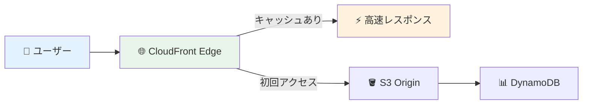
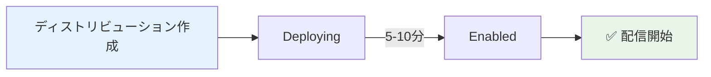

# 🌐 Step 6: CloudFront設定

## ⏱️ このステップの所要時間
**約15分**

## 🎯 このステップのゴール
- 世界中に高速配信するCloudFrontディストリビューションを作成する
- Origin Access Control（OAC）でセキュリティを向上させる
- キャッシュ設定を最適化してパフォーマンスを向上させる

---

## 📚 CloudFrontとは？

**Amazon CloudFront** は、AWSが提供するコンテンツ配信ネットワーク（CDN）サービスです。

:::info 💡 CloudFrontの利点
- **高速配信**: 世界中の300以上のエッジロケーションから配信
- **コスト削減**: S3からの直接転送コストを削減
- **セキュリティ**: Origin Access Controlでバケットを非公開化
- **可用性**: 複数のエッジで自動的に冗長化
:::

今回のシステムでは、生成されたサムネイル画像をCloudFront経由で高速配信します。



---

## 🚀 Step 5-1: CloudFrontディストリビューション作成

### CloudFrontサービスへ移動

1. **「サービス」** → **「ネットワークとコンテンツ配信」** → **「CloudFront」** を選択
2. **「ディストリビューションを作成」** ボタンをクリック

---

## 🎯 Step 5-2: オリジン設定

### オリジンドメインの選択

1. **「オリジンドメイン」** フィールドをクリック
2. プルダウンメニューから以下を選択：
   ```
   あなたのユーザー名-images.s3.ap-northeast-1.amazonaws.com
   ```

:::tip 💡 オリジンとは？
コンテンツの配信元となるサーバーのことです。今回はS3バケットがオリジンになります。
:::

### オリジンパス（オプション）

```yaml
オリジンパス: （空欄のまま）
```

オリジンパスを設定することで、特定のフォルダのみを配信対象にできますが、今回はバケット全体を対象とします。

---

## 🔐 Step 5-3: Origin Access Control（OAC）設定

### OACの作成

:::warning 🔒 重要なセキュリティ設定
OACを設定することで、CloudFrontからのみS3バケットにアクセスできるようになり、直接S3にアクセスされることを防げます。
:::

1. **「Origin access control settings (recommended)」** を選択
2. **「コントロール設定を作成」** をクリック

### OAC設定値

```yaml
名前: あなたのユーザー名-oac
例: 2025-tohoku-it-giovanni-oac

説明: OAC for handson image distribution
サイン: Sign requests (recommended)
オリジンタイプ: S3
```

3. **「作成」** ボタンをクリック
4. 作成したOACが自動選択されていることを確認

---

## ⚙️ Step 5-4: デフォルトキャッシュビヘイビア設定

### ビューワープロトコルポリシー

```yaml
ビューワープロトコルポリシー: Redirect HTTP to HTTPS
```

HTTPリクエストを自動的にHTTPSにリダイレクトし、セキュアな通信を強制します。

### 許可されたHTTPメソッド

```yaml
許可されたHTTPメソッド: GET, HEAD
```

画像配信のため、GET（ダウンロード）とHEAD（メタデータ取得）のみを許可します。

### キャッシュポリシー

```yaml
キャッシュキーとオリジンリクエスト: CachingOptimized
```

画像配信に最適化されたキャッシュポリシーを使用します。

---

## 🗺️ Step 5-5: 配信設定

### 価格クラス

```yaml
価格クラス: Use all edge locations (best performance)
```

:::info 💰 価格クラスについて
- **Use all edge locations**: 全世界で最高性能（最高価格）
- **Use North America and Europe**: 主要地域のみ（中価格）
- **Use only North America**: 北米のみ（最低価格）

ハンズオンでは性能重視で設定しますが、実際の運用では予算に応じて選択してください。
:::

### その他の設定

```yaml
代替ドメイン名 (CNAME): （空欄）
SSL証明書: Default CloudFront Certificate (*.cloudfront.net)
ログ記録: オフ
IPv6: 有効
コメント: Handson image distribution for あなたのユーザー名
```

---

## 📝 Step 5-6: ディストリビューション作成

1. 設定内容を確認
2. **「ディストリビューションを作成」** ボタンをクリック

:::caution ⏳ デプロイ時間について
CloudFrontディストリビューションの作成には **5-10分** かかります。
ステータスが「Deploying」から「Enabled」に変わるまでお待ちください。
:::



---

## 🔒 Step 5-7: S3バケットポリシー更新

ディストリビューション作成後、S3バケットへのアクセス権限を設定する必要があります。

### CloudFrontからのポリシー取得

1. 作成したCloudFrontディストリビューションをクリック
2. **「オリジン」** タブを選択
3. 作成したオリジンを選択して **「編集」** をクリック
4. ページ下部の **「バケットポリシーをコピー」** をクリック

### S3バケットポリシーの更新

1. **「サービス」** → **「S3」** を選択
2. **`あなたのユーザー名-images`** バケットをクリック
3. **「アクセス許可」** タブを選択
4. **「バケットポリシー」** → **「編集」** をクリック
5. コピーしたポリシーを貼り付け
6. **「変更の保存」** をクリック

:::info 📋 バケットポリシーの例
```json
{
    "Version": "2012-10-17",
    "Statement": [
        {
            "Effect": "Allow",
            "Principal": {
                "Service": "cloudfront.amazonaws.com"
            },
            "Action": "s3:GetObject",
            "Resource": "arn:aws:s3:::あなたのユーザー名-images/*",
            "Condition": {
                "StringEquals": {
                    "AWS:SourceArn": "arn:aws:cloudfront::123456789012:distribution/E1234567890123"
                }
            }
        }
    ]
}
```
このポリシーにより、指定されたCloudFrontディストリビューションからのみS3バケットにアクセスできるようになります。
:::

---

## ✅ 完了確認チェックリスト

以下のすべてが完了していることを確認：

### ディストリビューション作成
- [ ] CloudFrontディストリビューションを作成した
- [ ] 正しいS3バケットをオリジンに設定した
- [ ] OAC（Origin Access Control）を作成・設定した
- [ ] HTTPSリダイレクトを設定した

### セキュリティ設定
- [ ] S3バケットポリシーを更新した
- [ ] CloudFrontからのみアクセス可能になった
- [ ] ディストリビューションのステータスが「Enabled」になった

### 設定確認
- [ ] ドメイン名（例：d123abc456def.cloudfront.net）をメモした
- [ ] 価格クラスとキャッシュポリシーを確認した

---

## 🚨 トラブルシューティング

### Q: ディストリビューションの作成が進まない
**A:** CloudFrontのデプロイは時間がかかります。15分以上経っても変わらない場合は、ページを更新してステータスを確認してください。

### Q: S3バケットポリシーでエラーが出る
**A:** 以下を確認してください：
- コピーしたポリシーが正確か
- バケット名とディストリビューションIDが正しいか
- JSONの形式が正しいか（括弧や引用符の確認）

### Q: 「Access Denied」エラーが出る
**A:** OAC設定とバケットポリシーを確認してください：
- OACが正しく作成・設定されているか
- バケットポリシーが正しく設定されているか

---

## 🎊 Step 5 完了！

:::success おめでとうございます！
CloudFrontの設定が完了しました。これで世界中どこからでも高速に画像を配信できるようになりました！
:::

### 📝 このステップで学んだこと
- ✅ CloudFront CDNの仕組みと利点
- ✅ Origin Access Control（OAC）によるセキュリティ向上
- ✅ キャッシュポリシーの設定方法
- ✅ S3との連携によるコスト最適化

<div style={{textAlign: 'center', marginTop: '2rem', fontSize: '1.2em'}}>

[**← 前へ: Step 5 - S3イベント設定**](./05-s3-event) | [**次へ: Step 7 - システムテスト →**](./07-test)

</div>

---

## 📚 参考：CloudFrontの料金について

:::info 💰 CloudFrontの料金体系
- **データ転送料**: 配信量に応じて課金（最初の1TBは約$0.085/GB）
- **HTTPリクエスト料**: リクエスト数に応じて課金（$0.0075/10,000リクエスト）
- **オリジンリクエスト料**: S3へのリクエスト数（$0.0075/10,000リクエスト）

キャッシュにより、オリジンリクエストは大幅に削減されます。
:::

## 🔗 次のステップの準備

次のStep 6では、いよいよシステム全体の動作確認を行います：

1. 📸 画像をS3にアップロード
2. ⚡ Lambda関数が自動実行されることを確認
3. 🖼️ 3つのサイズのサムネイルが生成されることを確認
4. 📊 DynamoDBにメタデータが保存されることを確認
5. 🌐 CloudFront経由で画像にアクセスできることを確認

すべてが連携して動作する感動的な瞬間が待っています！