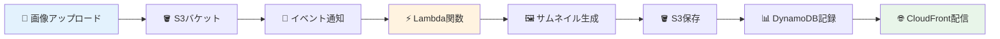
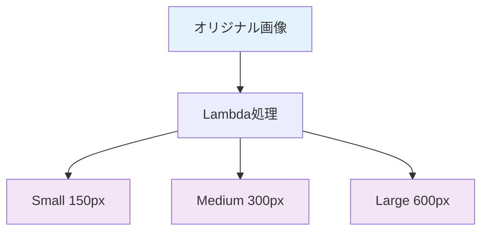

# 🧪 Step 6: システムテスト

## ⏱️ このステップの所要時間
**約10分**

## 🎯 このステップのゴール
- システム全体が正しく動作することを確認する
- 画像アップロードから配信までの一連の流れをテストする
- 各サービスの連携が正常に機能していることを検証する

---

## 🎉 ついに完成！システムテストの準備

ここまでで以下のシステムを構築しました：



いよいよ、このシステムが実際に動作するかテストしてみましょう！

---

## 📸 Step 6-1: テスト画像のダウンロード

### サンプル画像の取得

1. **「サービス」** → **「S3」** を選択
2. **`2025-tohoku-it-sample-images`** バケットをクリック
3. **`samples`** フォルダをクリック
4. 以下の画像の中から1つを選んでダウンロード：
   - `landscape_1.jpg` - 風景画像
   - `portrait_1.jpg` - ポートレート画像
   - `square_1.jpg` - 正方形画像

:::tip 💡 テスト用画像について
どの画像を選んでも問題ありません。ファイル名を覚えておいてください。
後でテスト結果を確認する際に使用します。
:::

---

## 🚀 Step 6-2: 画像のアップロードとシステム起動

### 自分のバケットに画像をアップロード

1. **S3** → **`あなたのユーザー名-images`** バケットをクリック
2. **「アップロード」** ボタンをクリック
3. **「ファイルを追加」** → ダウンロードした画像を選択
4. **「アップロード」** ボタンをクリック

:::info ⚡ 自動処理が開始されます！
アップロード完了と同時に、Lambda関数が自動的に実行され、サムネイル生成が始まります。
:::

### アップロード完了の確認

アップロードが完了したら、画面を閉じてバケットの一覧画面に戻ります。

---

## 📊 Step 6-3: Lambda実行ログの確認

Lambda関数が正常に実行されているかログを確認しましょう。

### CloudWatch Logsへ移動

1. **「サービス」** → **「管理とガバナンス」** → **「CloudWatch」** を選択
2. 左メニューから **「ログ」** → **「ロググループ」** をクリック
3. **`/aws/lambda/あなたのユーザー名-image-processor`** をクリック
4. 最新のログストリーム（一番上）をクリック

### 期待されるログ内容

正常に動作している場合、以下のようなログが表示されます：

```
[INFO] Processing: あなたのユーザー名-images/landscape_1.jpg
[INFO] Original image: 1920x1080, Format: JPEG, Size: 234567 bytes
[INFO] Created thumbnail: thumbnails/small/landscape_1_thumb.jpg (150x84)
[INFO] Created thumbnail: thumbnails/medium/landscape_1_thumb.jpg (300x169)
[INFO] Created thumbnail: thumbnails/large/landscape_1_thumb.jpg (600x338)
[INFO] Metadata saved to DynamoDB: landscape_1.jpg
[INFO] Processing completed successfully
```

:::success 🎉 ログが正常な場合
Lambda関数が正常に動作しています！次のステップに進みましょう。
:::

:::warning ⚠️ エラーログが表示される場合
[トラブルシューティング](#トラブルシューティング)セクションを確認してください。
:::

---

## 🖼️ Step 6-4: 生成されたサムネイルの確認

### S3バケットでサムネイル確認

1. **S3** → **`あなたのユーザー名-images`** バケットに戻る
2. ページを**更新**（F5キー）
3. **`thumbnails`** フォルダが作成されていることを確認
4. `thumbnails` フォルダをクリック

### 3つのサイズのサムネイル確認

以下のフォルダ構造が作成されているはずです：

```
thumbnails/
├── small/
│   └── landscape_1_thumb.jpg (150px幅)
├── medium/
│   └── landscape_1_thumb.jpg (300px幅)
└── large/
    └── landscape_1_thumb.jpg (600px幅)
```

各フォルダをクリックして、サムネイル画像が生成されていることを確認してください。



---

## 📊 Step 6-5: DynamoDBメタデータの確認

### DynamoDBテーブルの確認

1. **「サービス」** → **「DynamoDB」** を選択
2. **`あなたのユーザー名-image-metadata`** テーブルをクリック
3. **「項目を探索」** ボタンをクリック（または「テーブルの項目を表示」）

### 保存されたメタデータの確認

アップロードした画像のメタデータが以下のような形式で保存されているはずです：

```json
{
  "image_id": "landscape_1.jpg",
  "upload_time": "2025-01-09T10:30:00Z",
  "original_image": {
    "width": 1920,
    "height": 1080,
    "file_size": 234567,
    "format": "JPEG"
  },
  "thumbnails": {
    "small": "thumbnails/small/landscape_1_thumb.jpg",
    "medium": "thumbnails/medium/landscape_1_thumb.jpg", 
    "large": "thumbnails/large/landscape_1_thumb.jpg"
  },
  "cloudfront_url": "https://d123abc456def.cloudfront.net"
}
```

---

## 🌐 Step 6-6: CloudFront配信テスト

### CloudFrontドメイン名の確認

1. **「サービス」** → **「CloudFront」** を選択
2. 作成したディストリビューションをクリック
3. **「ドメイン名」** をコピー（例：`d123abc456def.cloudfront.net`）

### ブラウザでの配信確認

新しいタブで以下のURLにアクセス：

```
https://あなたのCloudFrontドメイン/thumbnails/medium/landscape_1_thumb.jpg
```

:::success ✅ 成功！
画像が正常に表示されれば、システム全体が正常に動作しています！
:::

---

## 🔄 Step 6-7: 複数画像での動作確認

### 追加テスト

システムの安定性を確認するため、複数の画像でテストしましょう：

1. サンプル画像から他の画像も1-2枚ダウンロード
2. 同様の手順でアップロード
3. それぞれについて：
   - Lambda実行ログの確認
   - サムネイル生成の確認
   - DynamoDBへの保存確認
   - CloudFrontでの配信確認

### 無限ループ対策の確認

:::info 🔄 無限ループ防止の仕組み
Lambda関数は、`thumbnails/` フォルダ内の画像については処理をスキップするようにプログラムされています。
:::

`thumbnails` フォルダ内の画像をコピーしても、Lambda関数が実行されないことをCloudWatch Logsで確認できます：

```
[INFO] Skipping processed image: thumbnails/small/test_thumb.jpg
```

---

## ✅ 完了確認チェックリスト

以下のすべてが完了していることを確認：

### システム全体の動作
- [ ] 画像をS3にアップロードできた
- [ ] Lambda関数が自動実行された
- [ ] CloudWatch Logsで正常なログが確認できた
- [ ] 3つのサイズのサムネイルが生成された

### データの保存と配信
- [ ] DynamoDBにメタデータが保存された
- [ ] CloudFront経由で画像にアクセスできた
- [ ] 複数の画像で同様の動作を確認した
- [ ] 無限ループが発生しないことを確認した

---

## 🚨 トラブルシューティング

### Q: Lambda関数が実行されない
**A:** 以下を確認してください：
- S3イベントトリガーが正しく設定されているか
- IAMロールに適切な権限があるか
- 環境変数`TABLE_NAME`が正しく設定されているか

### Q: サムネイルが生成されない
**A:** CloudWatch Logsを確認してください：
- タイムアウトエラーが発生していないか（設定を5分に変更）
- 権限エラーが発生していないか（IAMロール確認）
- 画像形式がサポートされているか（JPEG, PNG推奨）

### Q: CloudFrontで画像が表示されない
**A:** 以下を確認してください：
- ディストリビューションのステータスが「Enabled」になっているか
- S3バケットポリシーが正しく設定されているか
- URLのスペルが正しいか

### Q: DynamoDBにデータが保存されない
**A:** 以下を確認してください：
- テーブル名が正しいか（環境変数確認）
- DynamoDBへの権限があるか（IAMロール確認）
- Lambda関数のログでエラーが発生していないか

---

## 🎊 システムテスト完了！

:::success 🏆 おめでとうございます！
AWS画像処理システムが完璧に動作しています！

あなたが構築したシステム：
- **S3**: 画像ストレージとイベント発行
- **Lambda**: 自動画像処理とサムネイル生成
- **DynamoDB**: メタデータ管理
- **CloudFront**: 世界規模の高速配信

これらがすべて連携して、本格的な画像処理システムが完成しました！
:::

### 📝 このステップで学んだこと
- ✅ システム全体の動作確認方法
- ✅ CloudWatch Logsでのデバッグ手法
- ✅ 各AWSサービスの連携確認
- ✅ トラブルシューティングのアプローチ

<div style={{textAlign: 'center', marginTop: '2rem', fontSize: '1.2em'}}>

[**← 前へ: Step 5 - CloudFront設定**](./cloudfront) | [**次へ: Step 7 - トラブルシューティング →**](./troubleshooting)

</div>

---

## 🌟 次のステップ

システムテストが完了したら：
1. **トラブルシューティング**ページで問題解決方法を学習
2. **後片付け**でリソースをクリーンアップ
3. 学んだ技術を実際のプロジェクトに応用

## 💡 実際の運用で考慮すべきこと

- **モニタリング**: CloudWatchアラームの設定
- **コスト最適化**: 不要なリソースの定期削除
- **セキュリティ**: アクセスログの監視
- **バックアップ**: DynamoDBのバックアップ設定
- **スケーリング**: 大量アクセス時の対応

これで、本格的な画像処理システムの運用に向けた基礎が整いました！