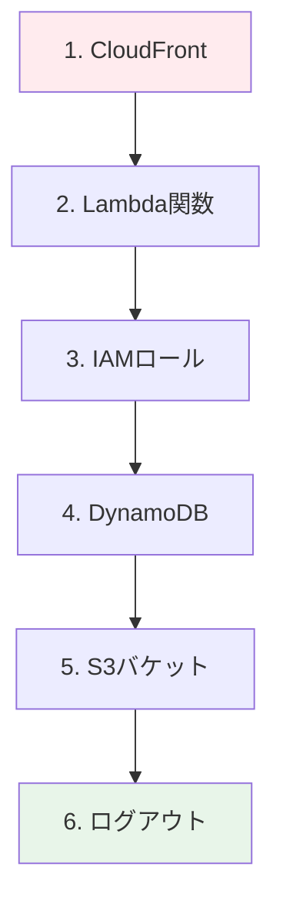

# 🧹 Step 9: 後片付け

## ⏱️ このステップの所要時間
**約5分**

## 🎯 このステップのゴール
- 作成したAWSリソースを削除して課金を停止する
- アカウントをクリーンな状態に戻す
- セキュリティのためのログアウト

---

## 💰 なぜ後片付けが重要？

ハンズオンで作成したリソースは、**放置すると継続的に課金**される可能性があります。

:::warning 💸 課金が発生するリソース
- **CloudFront**: データ転送量とリクエスト数
- **DynamoDB**: ストレージ使用量とリクエスト数  
- **Lambda**: 実行回数と実行時間
- **S3**: ストレージ使用量とリクエスト数

今回のハンズオンでは少量の課金ですが、削除しておくことをお勧めします。
:::

## 📋 削除すべきリソース一覧

作成したリソースを以下の順番で削除していきます：

:::info 🔄 削除の順序が重要
依存関係があるため、**必ずこの順番で削除**してください。
:::

---

## 🌐 Step 8-1: CloudFrontディストリビューションの削除

### ディストリビューションの無効化

1. **「サービス」** → **「CloudFront」** を選択
2. 作成したディストリビューションにチェックを入れる
3. **「無効にする」** ボタンをクリック
4. 確認ダイアログで **「無効にする」** をクリック

:::caution ⏳ 無効化の待機時間
ディストリビューションの無効化には**5-10分**かかります。
ステータスが「無効」になるまで待ってから次の手順に進んでください。
:::

### ディストリビューションの削除

無効化完了後：

1. ディストリビューションにチェックを入れる
2. **「削除」** ボタンをクリック
3. 確認ダイアログで **「削除」** をクリック

---

## ⚡ Step 8-2: Lambda関数の削除

### S3トリガーの削除

1. **「サービス」** → **「Lambda」** を選択
2. 作成したLambda関数をクリック
3. **「設定」** → **「トリガー」** タブ
4. S3トリガーを選択 → **「削除」** をクリック

### Lambda関数の削除

1. Lambda関数一覧に戻る
2. 作成した関数にチェックを入れる
3. **「アクション」** → **「削除」** をクリック
4. **「delete」** と入力して削除を確認

---

## 🔐 Step 8-3: IAMロールとポリシーの削除

### カスタムポリシーの削除

1. **「サービス」** → **「IAM」** を選択
2. **「ポリシー」** を選択
3. 作成したポリシーを検索：
   - `あなたのユーザー名-S3-Access`
   - `あなたのユーザー名-DynamoDB-Access`
4. それぞれを選択 → **「アクション」** → **「削除」** をクリック

### IAMロールの削除

1. **「ロール」** を選択
2. `あなたのユーザー名-lambda-role` を検索
3. ロール名をクリック
4. **「ポリシーをデタッチ」** で全てのポリシーを削除
5. **「ロールを削除」** をクリック

---

## 📊 Step 8-4: DynamoDBテーブルの削除

### テーブルの削除

1. **「サービス」** → **「DynamoDB」** を選択
2. 作成したテーブルにチェックを入れる
3. **「削除」** ボタンをクリック
4. **「削除の確認」** にチェックを入れる
5. **「delete」** と入力して削除を確認

:::info 📝 バックアップについて
削除前にテーブルの内容を確認したい場合は、「項目を探索」で確認できます。
:::

---

## 🪣 Step 8-5: S3バケットの削除

### バケット内のオブジェクトを削除

S3バケット自体を削除するには、まず中身を空にする必要があります：

1. **「サービス」** → **「S3」** を選択
2. `あなたのユーザー名-images` バケットをクリック
3. **「すべて選択」** にチェック
4. **「削除」** ボタンをクリック
5. **「permanently delete」** と入力して削除確認

### バケットの削除

バケットが空になったら：

1. S3バケット一覧に戻る
2. バケットにチェックを入れる
3. **「削除」** ボタンをクリック
4. バケット名を入力して削除を確認

---

## 🔍 Step 8-6: 削除の確認

以下のリソースがすべて削除されていることを確認してください：

### 削除確認チェックリスト

- [ ] **CloudFront**: ディストリビューション一覧が空
- [ ] **Lambda**: 作成した関数が一覧にない
- [ ] **IAM**: 作成したロールとポリシーが削除済み
- [ ] **DynamoDB**: 作成したテーブルが一覧にない  
- [ ] **S3**: 作成したバケットが一覧にない

:::success ✅ すべて削除完了
すべてのリソースが削除されました。課金の心配はありません！
:::

---

## 🚪 Step 8-7: ログアウト

### セキュリティのためのログアウト

1. 画面右上のユーザー名をクリック
2. **「サインアウト」** を選択
3. ログアウト完了を確認

:::tip 🔒 セキュリティの重要性
共用PCや他の人が使用する可能性がある環境では、必ずログアウトしてください。
:::

---

## 💡 削除時のトラブルシューティング

### Q: CloudFrontが削除できない

#### 症状
「ディストリビューションが使用中です」エラー

#### 解決方法
1. ディストリビューションを無効化
2. ステータスが「無効」になるまで待つ（5-10分）
3. 再度削除を試行

### Q: S3バケットが削除できない

#### 症状
「バケットが空ではありません」エラー

#### 解決方法
1. バケット内のすべてのオブジェクトを削除
2. 「すべてのバージョンを表示」をオンにして確認
3. 隠しオブジェクトや未完了のマルチパートアップロードも削除

### Q: IAMロールが削除できない

#### 症状
「ロールが使用中です」エラー

#### 解決方法
1. そのロールを使用しているリソース（Lambda関数など）を先に削除
2. アタッチされているポリシーをすべてデタッチ
3. 再度削除を試行

---

## 📊 課金の最終確認

削除完了後、念のため課金を確認しましょう：

### AWS Billing Dashboard での確認

1. **「サービス」** → **「請求とコスト管理」** を選択
2. **「請求書」** で当月の使用量を確認
3. **「Cost Explorer」** で詳細な使用状況を確認

:::info 💰 ハンズオンでの想定課金額
正常にリソースを削除した場合の課金額：
- **S3**: $0.01 未満（ストレージとリクエスト）
- **Lambda**: $0.01 未満（実行回数）
- **DynamoDB**: $0.01 未満（読み書きリクエスト）
- **CloudFront**: $0.01 未満（データ転送）

**合計**: $0.05 未満
:::

---

## 🎉 ハンズオン完了！

:::success 🏆 おめでとうございます！
AWS画像処理ハンズオンを完走しました！

**あなたが習得したスキル：**
- ✅ S3による画像ストレージ管理
- ✅ Lambdaサーバーレス関数の開発
- ✅ DynamoDBによるメタデータ管理
- ✅ CloudFrontによる世界規模の高速配信
- ✅ IAMによる適切な権限管理
- ✅ イベント駆動アーキテクチャの実装
- ✅ AWSリソースの運用とクリーンアップ
:::

### 📚 学んだアーキテクチャの価値

今回構築したシステムは：
- **本番環境で実用可能**な設計
- **数千万枚の画像**にスケール可能
- **世界中のユーザー**に高速配信
- **月額数百円**から運用可能

### 🔗 次のステップ

1. **他のAWSサービスを学習**
   - API Gateway、RDS、ElastiCache
   - コンテナ（ECS、EKS）
   - 機械学習（SageMaker）

2. **実際のプロジェクトに適用**
   - ポートフォリオサイト
   - 業務システム
   - 個人プロジェクト

3. **AWS認定資格の取得**
   - AWS Certified Cloud Practitioner
   - AWS Certified Developer - Associate

---

## 📝 アンケート・フィードバック

ハンズオンはいかがでしたか？ぜひフィードバックをお聞かせください：

- 理解しやすかった点
- 改善したほうが良い点
- 今後学びたい技術

**お疲れ様でした！** 🎊

---

[**← 前へ: Step 8 - トラブルシューティング**](./08-troubleshooting) | [**📋 ハンズオン概要に戻る**](./)

