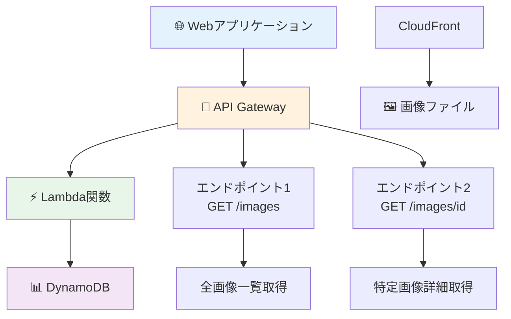

# 🌐 Step 10: API Gateway拡張機能（画像メタデータAPI）

## ⏱️ このステップの所要時間
**約25分**

## 🎯 このステップのゴール
- API GatewayとLambdaを連携してREST APIを構築
- DynamoDBに保存された画像メタデータを取得するAPIを実装
- Webアプリケーションから呼び出せるAPIエンドポイントを作成

---

## 💡 API Gatewayとは？

**API Gateway** は、REST APIやWebSocket APIを簡単に作成・公開・管理できるフルマネージドサービスです。

:::info 🌟 API Gatewayの利点
- **簡単なAPI作成**: コードを書かずにREST APIを構築
- **自動スケーリング**: トラフィックに応じて自動拡張
- **セキュリティ**: 認証・認可・レート制限の内蔵機能
- **統合**: Lambda、DynamoDB、S3との簡単な連携
- **CORS対応**: Webアプリケーションからの呼び出しに対応
:::

---

## 🏗️ API構成の全体像



---

## 🔧 Step 10-1: Lambda関数（API用）の作成

### 新しいLambda関数を作成

1. **Lambda コンソール** → **「関数の作成」**
2. 基本設定：

```yaml
作成方法: 一から作成
関数名: 2025-tohoku-it-あなたのユーザー名-api
例: 2025-tohoku-it-giovanni-api

ランタイム: Python 3.12
アーキテクチャ: x86_64
```

3. **実行ロール**: 既存のロール `2025-tohoku-it-あなたのユーザー名-lambda-role` を選択

### API用Lambda関数のコード

```python
import json
import boto3
import os
from decimal import Decimal
from boto3.dynamodb.conditions import Key

# DynamoDBリソース初期化
dynamodb = boto3.resource('dynamodb')
table = dynamodb.Table(os.environ['TABLE_NAME'])

def decimal_to_float(obj):
    """DynamoDBのDecimal型をfloatに変換"""
    if isinstance(obj, list):
        return [decimal_to_float(item) for item in obj]
    elif isinstance(obj, dict):
        return {key: decimal_to_float(value) for key, value in obj.items()}
    elif isinstance(obj, Decimal):
        return float(obj)
    return obj

def lambda_handler(event, context):
    """
    DynamoDBから画像メタデータを取得するAPI
    """
    try:
        # HTTPメソッドとパスを取得
        http_method = event.get('httpMethod', 'GET')
        path = event.get('path', '')
        path_parameters = event.get('pathParameters') or {}
        query_parameters = event.get('queryStringParameters') or {}
        
        print(f"API Request: {http_method} {path}")
        print(f"Path Parameters: {path_parameters}")
        print(f"Query Parameters: {query_parameters}")
        
        # ルーティング処理
        if http_method == 'GET':
            if path == '/images':
                # 全画像一覧取得
                return get_all_images(query_parameters)
            elif path.startswith('/images/') and path_parameters.get('id'):
                # 特定画像の詳細取得
                return get_image_by_id(path_parameters['id'])
        
        # 未対応のルートの場合
        return {
            'statusCode': 404,
            'headers': {
                'Content-Type': 'application/json',
                'Access-Control-Allow-Origin': '*',
                'Access-Control-Allow-Methods': 'GET, OPTIONS',
                'Access-Control-Allow-Headers': 'Content-Type'
            },
            'body': json.dumps({
                'error': 'Not Found',
                'message': 'リクエストされたエンドポイントが見つかりません'
            }, ensure_ascii=False)
        }
        
    except Exception as e:
        print(f"API Error: {str(e)}")
        import traceback
        traceback.print_exc()
        
        return {
            'statusCode': 500,
            'headers': {
                'Content-Type': 'application/json',
                'Access-Control-Allow-Origin': '*',
                'Access-Control-Allow-Methods': 'GET, OPTIONS',
                'Access-Control-Allow-Headers': 'Content-Type'
            },
            'body': json.dumps({
                'error': 'Internal Server Error',
                'message': 'サーバー内部でエラーが発生しました'
            }, ensure_ascii=False)
        }

def get_all_images(query_params):
    """
    全画像の一覧を取得（最新順）
    """
    try:
        # ページネーション用のパラメータ
        limit = int(query_params.get('limit', 20))  # デフォルト20件
        limit = min(limit, 100)  # 最大100件まで
        
        # DynamoDBからデータを取得（最新順）
        scan_kwargs = {
            'Limit': limit
        }
        
        # ページネーション対応（簡易版）
        if query_params.get('last_key'):
            # 実装を簡単にするため、ここでは省略
            pass
        
        response = table.scan(**scan_kwargs)
        items = response.get('Items', [])
        
        # 日付でソート（最新順）
        items.sort(key=lambda x: x.get('upload_time', ''), reverse=True)
        
        # レスポンス用にデータを整形
        formatted_items = []
        for item in items:
            formatted_item = {
                'image_id': item.get('image_id'),
                'upload_time': item.get('upload_time'),
                'original_image': decimal_to_float(item.get('original_image', {})),
                'thumbnail_count': len(item.get('processed_images', [])),
                'formats_available': list(set([
                    img.get('format', 'UNKNOWN') 
                    for img in item.get('processed_images', [])
                ]))
            }
            formatted_items.append(formatted_item)
        
        return {
            'statusCode': 200,
            'headers': {
                'Content-Type': 'application/json',
                'Access-Control-Allow-Origin': '*',
                'Access-Control-Allow-Methods': 'GET, OPTIONS',
                'Access-Control-Allow-Headers': 'Content-Type'
            },
            'body': json.dumps({
                'images': formatted_items,
                'count': len(formatted_items),
                'limit': limit
            }, ensure_ascii=False)
        }
        
    except Exception as e:
        print(f"get_all_images error: {str(e)}")
        raise e

def get_image_by_id(image_id):
    """
    特定のimage_idの詳細情報を取得
    """
    try:
        # DynamoDBから特定のアイテムを取得
        response = table.get_item(
            Key={'image_id': image_id}
        )
        
        if 'Item' not in response:
            return {
                'statusCode': 404,
                'headers': {
                    'Content-Type': 'application/json',
                    'Access-Control-Allow-Origin': '*',
                    'Access-Control-Allow-Methods': 'GET, OPTIONS',
                    'Access-Control-Allow-Headers': 'Content-Type'
                },
                'body': json.dumps({
                    'error': 'Not Found',
                    'message': f'画像ID {image_id} が見つかりません'
                }, ensure_ascii=False)
            }
        
        item = response['Item']
        
        # レスポンス用にデータを整形
        formatted_item = {
            'image_id': item.get('image_id'),
            'upload_time': item.get('upload_time'),
            'original_image': decimal_to_float(item.get('original_image', {})),
            'processed_images': decimal_to_float(item.get('processed_images', []))
        }
        
        # ファイルサイズやフォーマット別の統計を追加
        processed_images = formatted_item['processed_images']
        stats = {
            'total_files': len(processed_images),
            'formats': {},
            'sizes': {},
            'total_size': sum(img.get('file_size', 0) for img in processed_images)
        }
        
        for img in processed_images:
            fmt = img.get('format', 'UNKNOWN')
            size = img.get('size', 'unknown')
            
            if fmt not in stats['formats']:
                stats['formats'][fmt] = \{'count': 0, 'total_size': 0\}
            stats['formats'][fmt]['count'] += 1
            stats['formats'][fmt]['total_size'] += img.get('file_size', 0)
            
            if size not in stats['sizes']:
                stats['sizes'][size] = \{'count': 0, 'total_size': 0\}
            stats['sizes'][size]['count'] += 1
            stats['sizes'][size]['total_size'] += img.get('file_size', 0)
        
        formatted_item['stats'] = stats
        
        return {
            'statusCode': 200,
            'headers': {
                'Content-Type': 'application/json',
                'Access-Control-Allow-Origin': '*',
                'Access-Control-Allow-Methods': 'GET, OPTIONS',
                'Access-Control-Allow-Headers': 'Content-Type'
            },
            'body': json.dumps(formatted_item, ensure_ascii=False)
        }
        
    except Exception as e:
        print(f"get_image_by_id error: {str(e)}")
        raise e
```

### 環境変数の設定

1. **「設定」** → **「環境変数」** → **「編集」**
2. **「環境変数を追加」**：

```yaml
キー: TABLE_NAME
値: 2025-tohoku-it-あなたのユーザー名-image-metadata
```

3. **「保存」**

---

## 🌐 Step 10-2: API Gatewayの作成

### REST APIの作成

1. **API Gateway コンソール** → **「APIを作成」**
2. **REST API** を選択 → **「構築」**
3. API設定：

```yaml
API名: 2025-tohoku-it-あなたのユーザー名-image-api
説明: Image metadata API for handson
エンドポイントタイプ: リージョン
```

4. **「APIを作成」**

### リソースとメソッドの作成

#### 1. /images リソースの作成

1. **「リソース」** → **「リソースを作成」**
2. リソース設定：

```yaml
リソース名: images
リソースパス: /images
```

3. **「リソースを作成」**

#### 2. GETメソッドの追加（全画像一覧）

1. `/images` リソースを選択 → **「メソッドを作成」**
2. メソッド設定：

```yaml
メソッドタイプ: GET
統合タイプ: Lambda関数
Lambda関数: 2025-tohoku-it-あなたのユーザー名-api
```

3. **「メソッドを作成」**

#### 3. `/\{id\}` リソースの作成

1. `/images` を選択 → **「リソースを作成」**
2. リソース設定：

```yaml
リソース名: `\{id\}`
リソースパス: `/\{id\}`
```

3. **「リソースを作成」**

#### 4. GETメソッドの追加（特定画像詳細）

1. **/\{id\}** リソースを選択 → **「メソッドを作成」**
2. メソッド設定：

```yaml
メソッドタイプ: GET
統合タイプ: Lambda関数
Lambda関数: 2025-tohoku-it-あなたのユーザー名-api
```

3. **「メソッドを作成」**

### CORS設定

各メソッドでCORSを有効化：

1. メソッドを選択 → **「CORS」**
2. **「CORSを有効にする」**
3. 設定：

```yaml
Access-Control-Allow-Origin: *
Access-Control-Allow-Headers: Content-Type,X-Amz-Date,Authorization,X-Api-Key
Access-Control-Allow-Methods: GET,OPTIONS
```

4. **「保存」**

---

## 🚀 Step 10-3: APIのデプロイ

### ステージの作成

1. **「デプロイ」** → **「新しいステージ」**
2. ステージ設定：

```yaml
ステージ名: prod
説明: Production stage for handson
```

3. **「デプロイ」**

### APIエンドポイントの確認

デプロイ後、以下のようなURLが生成されます：

```
https://xxxxxxxxxx.execute-api.ap-northeast-1.amazonaws.com/prod/images
https://xxxxxxxxxx.execute-api.ap-northeast-1.amazonaws.com/prod/images/IMAGE_ID
```

---

## 🧪 Step 10-4: APIのテスト

### ブラウザでのテスト

1. **全画像一覧取得**：
   ```
   https://your-api-gateway-url/prod/images
   ```

2. **特定画像詳細取得**：
   ```
   https://your-api-gateway-url/prod/images/dc925a02-06f1-49e3-9895-3c3f1797a584
   ```

### 期待されるレスポンス例

#### 全画像一覧（/images）

```json
{
  "images": [
    {
      "image_id": "dc925a02-06f1-49e3-9895-3c3f1797a584",
      "upload_time": "2025-01-15T10:30:45.123Z",
      "original_image": {
        "key": "uploads/forest.jpg",
        "width": 1920,
        "height": 1080,
        "file_size": 234567,
        "format": "JPEG"
      },
      "thumbnail_count": 7,
      "formats_available": ["JPEG", "WEBP"]
    }
  ],
  "count": 1,
  "limit": 20
}
```

#### 特定画像詳細（`/images/\{id\}`）

```json
{
  "image_id": "dc925a02-06f1-49e3-9895-3c3f1797a584",
  "upload_time": "2025-01-15T10:30:45.123Z",
  "original_image": {
    "key": "uploads/forest.jpg",
    "width": 1920,
    "height": 1080,
    "file_size": 234567,
    "format": "JPEG"
  },
  "processed_images": [
    {
      "key": "thumbnails/forest_small.jpg",
      "size": "small",
      "width": 150,
      "height": 84,
      "file_size": 8192,
      "format": "JPEG"
    },
    {
      "key": "webp/forest_small.webp",
      "size": "small",
      "width": 150,
      "height": 84,
      "file_size": 5234,
      "format": "WEBP"
    }
  ],
  "stats": {
    "total_files": 7,
    "formats": {
      "JPEG": \{"count": 3, "total_size": 95432\},
      "WEBP": \{"count": 4, "total_size": 67890\}
    },
    "total_size": 163322
  }
}
```

---

## 🌐 Step 10-5: フロントエンド実装例

### JavaScript での API 呼び出し

```javascript
// API Base URL（あなたのAPI Gateway URLに置き換え）
const API_BASE_URL = 'https://xxxxxxxxxx.execute-api.ap-northeast-1.amazonaws.com/prod';

// 全画像一覧を取得
async function getAllImages(limit = 20) {
    try {
        const response = await fetch(`\${API_BASE_URL}/images?limit=\${limit}`);
        const data = await response.json();
        return data;
    } catch (error) {
        console.error('画像一覧取得エラー:', error);
        return null;
    }
}

// 特定画像の詳細を取得
async function getImageById(imageId) {
    try {
        const response = await fetch(`\${API_BASE_URL}/images/\${imageId}`);
        const data = await response.json();
        return data;
    } catch (error) {
        console.error('画像詳細取得エラー:', error);
        return null;
    }
}

// 使用例
async function displayImages() {
    const result = await getAllImages(10);
    if (result && result.images) {
        result.images.forEach(image => {
            console.log(`画像ID: \${image.image_id}`);
            console.log(`アップロード日時: \${image.upload_time}`);
            console.log(`利用可能形式: \${image.formats_available.join(', ')}`);
        });
    }
}

// 画像ギャラリーの作成例
async function createImageGallery(containerId) {
    const container = document.getElementById(containerId);
    const result = await getAllImages();
    
    if (result && result.images) {
        result.images.forEach(async (image) => {
            const detail = await getImageById(image.image_id);
            if (detail) {
                // CloudFront URLを構築
                const cloudFrontUrl = 'https://your-cloudfront-domain.cloudfront.net';
                const thumbnailUrl = `\${cloudFrontUrl}/thumbnails/\${detail.original_image.key.replace('uploads/', '')}_medium.jpg`;
                
                // 画像要素を作成
                const imgElement = document.createElement('img');
                imgElement.src = thumbnailUrl;
                imgElement.alt = `Image \${image.image_id}`;
                imgElement.style.maxWidth = '200px';
                imgElement.style.margin = '10px';
                
                container.appendChild(imgElement);
            }
        });
    }
}
```

### HTML実装例

```html
<!DOCTYPE html>
<html lang="ja">
<head>
    <meta charset="UTF-8">
    <meta name="viewport" content="width=device-width, initial-scale=1.0">
    <title>画像ギャラリー - ハンズオンAPI</title>
    <style>
        .gallery {
            display: grid;
            grid-template-columns: repeat(auto-fill, minmax(250px, 1fr));
            gap: 20px;
            padding: 20px;
        }
        .image-card {
            border: 1px solid #ddd;
            border-radius: 8px;
            padding: 15px;
            background: #f9f9f9;
        }
        .image-card img {
            width: 100%;
            height: auto;
            border-radius: 4px;
        }
    </style>
</head>
<body>
    <h1>📸 画像ギャラリー</h1>
    <div id="gallery" class="gallery"></div>
    
    <script>
        // 上記のJavaScriptコードをここに配置
        
        // ページ読み込み時にギャラリーを作成
        document.addEventListener('DOMContentLoaded', () => {
            createImageGallery('gallery');
        });
    </script>
</body>
</html>
```

---

## 🚨 トラブルシューティング

### Q: APIが404エラーを返す

#### 原因と対処
1. **Lambda関数のルーティング**: パスパラメータの設定を確認
2. **API Gatewayの設定**: リソースパスとメソッドが正しく設定されているか
3. **デプロイ**: 変更後に必ずデプロイが必要

### Q: CORS エラーが発生する

#### 解決方法
```yaml
設定確認:
1. API Gateway の各メソッドでCORSを有効化
2. Lambda関数のレスポンスヘッダーを確認
3. プリフライトリクエスト（OPTIONS）の設定
```

### Q: DynamoDB データが取得できない

#### 確認点
1. **環境変数**: `TABLE_NAME` が正しく設定されているか
2. **IAMロール**: DynamoDBの読み取り権限があるか
3. **テーブル名**: DynamoDBテーブル名が正確か

### Q: Decimal エラーが発生する

#### 原因
DynamoDBのDecimal型がJSON serializable ではない

#### 解決方法
コード内の `decimal_to_float` 関数で自動変換されています

---

## 🏆 Step 10完了！

:::success 🎉 API Gateway拡張機能の実装完了！

**習得した実践的なスキル：**
- ✅ API Gateway + Lambda の連携
- ✅ RESTful API の設計と実装
- ✅ DynamoDB データの効率的な取得
- ✅ CORS対応のWeb API開発
- ✅ フロントエンド連携の実装

**構築したAPI：**
- 📡 画像一覧取得 API: `GET /images`
- 🔍 画像詳細取得 API: GET `/images/\{id\}`
- 🌐 CORS対応によるWeb連携
- 📊 統計情報付きレスポンス
:::

### 📚 このステップで学んだ技術

1. **サーバーレスAPI開発**
   - API Gateway の設定と管理
   - Lambda 関数でのルーティング処理

2. **データベース連携**
   - DynamoDB からの効率的なデータ取得
   - データ型変換とJSON応答の最適化

3. **Web開発の実践**
   - CORS設定による Cross-Origin アクセス対応
   - RESTful API の設計原則

---

<div style={{textAlign: 'center', marginTop: '2rem', fontSize: '1.2em'}}>

[**← 前へ: Step 9 - テスト実行**](./test) | [**次へ: Step 11 - X-Ray分散トレース →**](./xray-extension)

</div>

## 💡 次のステップの提案

このAPIを活用して、さらなる機能拡張が可能です：

### 🚀 発展的な機能例

1. **認証機能の追加**
   - Cognitoによるユーザー認証
   - JWTトークンによるAPI保護

2. **検索機能の実装**
   - 画像形式による絞り込み
   - 日付範囲での検索
   - ファイルサイズでの並び替え

3. **管理機能の追加**
   - 画像の削除API
   - メタデータの更新API
   - バッチ処理API

4. **高度なフロントエンド**
   - React/Vue.js での SPA 構築
   - リアルタイム更新（WebSocket API）
   - 画像のドラッグ＆ドロップアップロード
