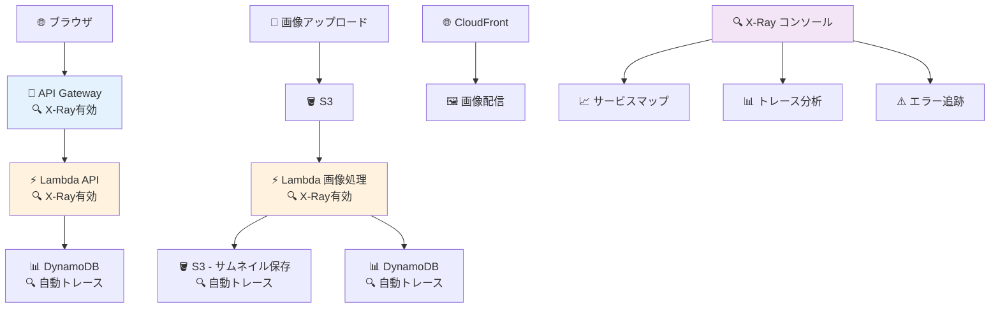

# 🔍 Step 11: X-Ray分散トレース（システム監視強化）

## ⏱️ このステップの所要時間
**約20分**

## 🎯 このステップのゴール
- AWS X-Rayによる分散トレース機能を導入
- Lambda関数、API Gateway、DynamoDBの呼び出しを可視化
- パフォーマンスボトルネックの特定方法を習得
- 本格的なシステム監視の基盤を構築

---

## 💡 AWS X-Rayとは？

**AWS X-Ray** は、分散アプリケーションの動作を追跡・分析できるトレーシングサービスです。

:::info 🌟 X-Rayの特徴
- **分散トレース**: 複数のサービスをまたがるリクエストの流れを可視化
- **パフォーマンス分析**: 各処理の実行時間とボトルネックを特定
- **エラー追跡**: 障害発生箇所の迅速な特定
- **サービスマップ**: システム全体のアーキテクチャを自動生成
- **簡単導入**: 設定変更だけで有効化可能
:::

---

## 🏗️ X-Ray監視対象の全体像



---

## 🔧 Step 11-1: API Gateway でのX-Ray有効化

### API Gateway設定

1. **API Gateway コンソール** → あなたのAPI（`2025-tohoku-it-あなたのユーザー名-image-api`）を選択
2. **「設定」** をクリック
3. **「X-Ray トレース」** セクションで **「X-Ray トレースを有効にする」** にチェック
4. **「変更の保存」** をクリック

:::tip 💡 API Gateway X-Ray設定
この設定により、API Gatewayへの全てのリクエストが自動的にトレースされ、レスポンス時間や呼び出し頻度が記録されます。
:::

### API再デプロイ

X-Ray設定を反映するため、APIを再デプロイします：

1. **「リソース」** → **「アクション」** → **「APIのデプロイ」**
2. **「デプロイされたステージ」**: `prod` を選択
3. **「デプロイ」** をクリック

---

## ⚡ Step 11-2: Lambda関数でのX-Ray有効化

### 画像処理Lambda関数の設定

1. **Lambda コンソール** → `2025-tohoku-it-あなたのユーザー名-image-processor` を選択
2. **「設定」** → **「監視およびオペレーションツール」** をクリック
3. **「AWS X-Ray」** セクションで **「アクティブトレースの有効化」** にチェック
4. **「保存」** をクリック

### API用Lambda関数の設定

1. **Lambda コンソール** → `2025-tohoku-it-あなたのユーザー名-api` を選択
2. **「設定」** → **「監視およびオペレーションツール」** をクリック
3. **「AWS X-Ray」** セクションで **「アクティブトレースの有効化」** にチェック
4. **「保存」** をクリック

### Lambda関数コードの拡張（API用）

API用Lambda関数にX-Rayトレース用のコードを追加します：

```python
import json
import boto3
import os
from decimal import Decimal
from boto3.dynamodb.conditions import Key

# 🔍 X-Ray用のインポート
from aws_xray_sdk.core import xray_recorder
from aws_xray_sdk.core import patch_all

# 🔍 AWS SDKを自動的にトレース対象にする
patch_all()

# DynamoDBリソース初期化
dynamodb = boto3.resource('dynamodb')
table = dynamodb.Table(os.environ['TABLE_NAME'])

def decimal_to_float(obj):
    """DynamoDBのDecimal型をfloatに変換"""
    if isinstance(obj, list):
        return [decimal_to_float(item) for item in obj]
    elif isinstance(obj, dict):
        return {key: decimal_to_float(value) for key, value in obj.items()}
    elif isinstance(obj, Decimal):
        return float(obj)
    return obj

@xray_recorder.capture('lambda_handler')
def lambda_handler(event, context):
    """
    DynamoDBから画像メタデータを取得するAPI
    🔍 X-Ray トレース対応版
    """
    try:
        # 🔍 カスタムメタデータをX-Rayに追加
        xray_recorder.put_metadata('request_info', {
            'method': event.get('httpMethod'),
            'path': event.get('path'),
            'user_agent': event.get('headers', {}).get('User-Agent', 'unknown')
        })
        
        # HTTPメソッドとパスを取得
        http_method = event.get('httpMethod', 'GET')
        path = event.get('path', '')
        path_parameters = event.get('pathParameters') or {}
        query_parameters = event.get('queryStringParameters') or {}
        
        print(f"API Request: {http_method} {path}")
        
        # ルーティング処理
        if http_method == 'GET':
            if path == '/images':
                return get_all_images(query_parameters)
            elif path.startswith('/images/') and path_parameters.get('id'):
                return get_image_by_id(path_parameters['id'])
        
        # 未対応のルートの場合
        return create_error_response(404, 'Not Found', 'リクエストされたエンドポイントが見つかりません')
        
    except Exception as e:
        print(f"API Error: {str(e)}")
        
        # 🔍 エラー情報をX-Rayに記録
        xray_recorder.put_annotation('error_type', type(e).__name__)
        xray_recorder.put_metadata('error_details', {
            'message': str(e),
            'path': event.get('path', 'unknown')
        })
        
        return create_error_response(500, 'Internal Server Error', 'サーバー内部でエラーが発生しました')

@xray_recorder.capture('get_all_images')
def get_all_images(query_params):
    """
    全画像の一覧を取得（最新順）
    🔍 X-Ray サブセグメント対応
    """
    try:
        # ページネーション用のパラメータ
        limit = int(query_params.get('limit', 20))
        limit = min(limit, 100)
        
        # 🔍 X-Rayアノテーション追加
        xray_recorder.put_annotation('query_limit', limit)
        
        # 🔍 DynamoDB操作のサブセグメント
        with xray_recorder.in_subsegment('dynamodb_scan'):
            scan_kwargs = {'Limit': limit}
            response = table.scan(**scan_kwargs)
            items = response.get('Items', [])
            
            # 🔍 結果をX-Rayメタデータに記録
            xray_recorder.put_metadata('scan_result', {
                'items_count': len(items),
                'consumed_capacity': response.get('ConsumedCapacity')
            })
        
        # 日付でソート（最新順）
        with xray_recorder.in_subsegment('sort_processing'):
            items.sort(key=lambda x: x.get('upload_time', ''), reverse=True)
        
        # レスポンス用にデータを整形
        with xray_recorder.in_subsegment('data_formatting'):
            formatted_items = []
            for item in items:
                formatted_item = {
                    'image_id': item.get('image_id'),
                    'upload_time': item.get('upload_time'),
                    'original_image': decimal_to_float(item.get('original_image', {})),
                    'thumbnail_count': len(item.get('processed_images', [])),
                    'formats_available': list(set([
                        img.get('format', 'UNKNOWN') 
                        for img in item.get('processed_images', [])
                    ]))
                }
                formatted_items.append(formatted_item)
        
        return create_success_response({
            'images': formatted_items,
            'count': len(formatted_items),
            'limit': limit
        })
        
    except Exception as e:
        print(f"get_all_images error: {str(e)}")
        xray_recorder.put_annotation('get_all_images_error', str(e))
        raise e

@xray_recorder.capture('get_image_by_id')
def get_image_by_id(image_id):
    """
    特定のimage_idの詳細情報を取得
    🔍 X-Ray サブセグメント対応
    """
    try:
        # 🔍 X-Rayアノテーション追加
        xray_recorder.put_annotation('requested_image_id', image_id)
        
        # 🔍 DynamoDB操作のサブセグメント
        with xray_recorder.in_subsegment('dynamodb_get_item'):
            response = table.get_item(Key={'image_id': image_id})
            
            if 'Item' not in response:
                xray_recorder.put_annotation('image_found', False)
                return create_error_response(404, 'Not Found', f'画像ID {image_id} が見つかりません')
            
            xray_recorder.put_annotation('image_found', True)
            item = response['Item']
        
        # レスポンス用にデータを整形
        with xray_recorder.in_subsegment('data_processing'):
            formatted_item = {
                'image_id': item.get('image_id'),
                'upload_time': item.get('upload_time'),
                'original_image': decimal_to_float(item.get('original_image', {})),
                'processed_images': decimal_to_float(item.get('processed_images', []))
            }
            
            # 統計情報の計算
            processed_images = formatted_item['processed_images']
            stats = calculate_image_stats(processed_images)
            formatted_item['stats'] = stats
            
            # 🔍 統計情報をX-Rayメタデータに記録
            xray_recorder.put_metadata('image_stats', stats)
        
        return create_success_response(formatted_item)
        
    except Exception as e:
        print(f"get_image_by_id error: {str(e)}")
        xray_recorder.put_annotation('get_image_by_id_error', str(e))
        raise e

@xray_recorder.capture('calculate_image_stats')
def calculate_image_stats(processed_images):
    """
    画像統計情報を計算
    """
    stats = {
        'total_files': len(processed_images),
        'formats': {},
        'sizes': {},
        'total_size': sum(img.get('file_size', 0) for img in processed_images)
    }
    
    for img in processed_images:
        fmt = img.get('format', 'UNKNOWN')
        size = img.get('size', 'unknown')
        
        if fmt not in stats['formats']:
            stats['formats'][fmt] = {'count': 0, 'total_size': 0}
        stats['formats'][fmt]['count'] += 1
        stats['formats'][fmt]['total_size'] += img.get('file_size', 0)
        
        if size not in stats['sizes']:
            stats['sizes'][size] = {'count': 0, 'total_size': 0}
        stats['sizes'][size]['count'] += 1
        stats['sizes'][size]['total_size'] += img.get('file_size', 0)
    
    return stats

def create_success_response(data):
    """成功レスポンスを作成"""
    return {
        'statusCode': 200,
        'headers': {
            'Content-Type': 'application/json',
            'Access-Control-Allow-Origin': '*',
            'Access-Control-Allow-Methods': 'GET, OPTIONS',
            'Access-Control-Allow-Headers': 'Content-Type'
        },
        'body': json.dumps(data, ensure_ascii=False)
    }

def create_error_response(status_code, error_type, message):
    """エラーレスポンスを作成"""
    return {
        'statusCode': status_code,
        'headers': {
            'Content-Type': 'application/json',
            'Access-Control-Allow-Origin': '*',
            'Access-Control-Allow-Methods': 'GET, OPTIONS',
            'Access-Control-Allow-Headers': 'Content-Type'
        },
        'body': json.dumps({
            'error': error_type,
            'message': message
        }, ensure_ascii=False)
    }
```

### X-Ray SDK レイヤーの追加

Lambda関数でX-Ray SDKを使用するため、レイヤーを追加します：

1. **Lambda関数の「コード」タブ** → **「レイヤー」** → **「レイヤーの追加」**
2. **「ARNを指定」** を選択
3. 以下のARNを入力：

```
arn:aws:lambda:ap-northeast-1:901920570463:layer:aws-xray-sdk-python3:3
```

4. **「追加」** をクリック

---

## 🧪 Step 11-3: X-Rayトレースのテスト

### APIの呼び出しテスト

1. **APIを数回呼び出す**：
   ```bash
   # ブラウザまたはcurlで実行
   curl "https://your-api-gateway-url/prod/images"
   curl "https://your-api-gateway-url/prod/images/your-image-id"
   ```

2. **画像をアップロード**してLambda処理をトリガー

### X-Rayコンソールでの確認

1. **X-Ray コンソール** → **「トレース」** を開く
2. **時間範囲** を直近の1時間に設定
3. 実行されたトレースの一覧を確認

---

## 📊 Step 11-4: トレース分析の実践

### サービスマップの確認

1. **X-Ray コンソール** → **「サービスマップ」**
2. システム全体のアーキテクチャが自動生成されて表示される
3. 各サービス間の呼び出し関係と処理時間を確認

### 個別トレースの詳細分析

1. **「トレース」** タブで特定のトレースをクリック
2. **タイムライン表示** で各処理の実行時間を確認
3. **各セグメント** をクリックして詳細情報を表示

### パフォーマンス分析例

以下のような情報が確認できます：

```
🔍 トレース例: GET /images API呼び出し

総実行時間: 245ms
├── API Gateway: 15ms
├── Lambda関数起動: 45ms
│   ├── DynamoDB Scan: 120ms  ← 🚨 ボトルネック
│   ├── データソート: 25ms
│   └── レスポンス整形: 35ms
└── レスポンス返却: 5ms

📊 アノテーション:
- query_limit: 20
- items_count: 15
- image_found: true

📝 メタデータ:
- User-Agent: Mozilla/5.0...
- scan_result: {"items_count": 15, "consumed_capacity": 2.5}
```

---

## 🔍 Step 11-5: 高度なX-Ray機能の活用

### カスタムアノテーションの追加

画像処理Lambda関数にもX-Ray機能を追加：

```python
# 画像処理Lambda関数の先頭に追加
from aws_xray_sdk.core import xray_recorder
from aws_xray_sdk.core import patch_all

patch_all()  # AWS SDKを自動トレース

@xray_recorder.capture('lambda_handler')
def lambda_handler(event, context):
    """画像処理Lambda関数 - X-Ray対応版"""
    try:
        # 処理開始時のメタデータ記録
        xray_recorder.put_metadata('image_processing_start', {
            'bucket': bucket,
            'key': key,
            'file_size': len(image_content)
        })
        
        # サムネイル生成部分
        with xray_recorder.in_subsegment('thumbnail_generation'):
            for size_name, size_px in thumbnail_sizes.items():
                with xray_recorder.in_subsegment(f'create_{size_name}_thumbnail'):
                    # サムネイル作成処理
                    pass
        
        # WebP変換部分  
        with xray_recorder.in_subsegment('webp_conversion'):
            # WebP変換処理
            pass
            
        # 処理完了時の統計記録
        xray_recorder.put_annotation('thumbnails_created', len(processed_images))
        xray_recorder.put_annotation('processing_successful', True)
        
    except Exception as e:
        xray_recorder.put_annotation('processing_successful', False)
        xray_recorder.put_annotation('error_type', type(e).__name__)
        raise e
```

### フィルター式を使った分析

X-Rayコンソールで以下のような条件で絞り込み：

```
# エラーが発生したトレースのみ表示
error

# 実行時間が長いトレースを検索
responsetime > 1

# 特定のアノテーションでフィルタ
annotation.query_limit > 10

# 複合条件
service("your-api-gateway") AND responsetime > 0.5
```

---

## 🚨 トラブルシューティング

### Q: X-Rayトレースが表示されない

#### 確認ポイント
1. **IAMロール権限**: Lambda実行ロールに `AWSXRayDaemonWriteAccess` ポリシーが必要
2. **アクティブトレース**: Lambda関数設定でX-Rayが有効になっているか
3. **SDK設定**: X-Ray SDKレイヤーが正しく追加されているか

#### 権限の追加方法
```yaml
Lambda実行ロールに以下のポリシーを追加:
- AWSXRayDaemonWriteAccess (AWS管理ポリシー)
```

### Q: エラー "Unable to import module"

#### 原因と解決方法
```python
# X-Ray SDKのインポートエラー回避
try:
    from aws_xray_sdk.core import xray_recorder
    from aws_xray_sdk.core import patch_all
    XRAY_AVAILABLE = True
except ImportError:
    print("X-Ray SDK not available")
    XRAY_AVAILABLE = False

# 条件付きでX-Ray機能を使用
if XRAY_AVAILABLE:
    patch_all()
```

### Q: DynamoDBトレースが表示されない

#### 解決方法
`patch_all()` の呼び出しがDynamoDBクライアント作成前に実行されていることを確認

---

## 📈 パフォーマンス最適化のヒント

### 1. ボトルネックの特定

X-Rayトレースで以下を確認：
- **DynamoDB**: スキャン vs クエリの性能差
- **Lambda**: コールドスタート vs ウォームスタート
- **S3**: 画像サイズと処理時間の相関

### 2. 最適化の実装

```python
# DynamoDB最適化例
@xray_recorder.capture('optimized_scan')
def optimized_get_images():
    # GSI（Global Secondary Index）を使用
    response = table.query(
        IndexName='upload-time-index',
        KeyConditionExpression=Key('status').eq('processed'),
        ScanIndexForward=False,  # 降順ソート
        Limit=20
    )
```

---

## 🏆 Step 11完了！

:::success 🎉 X-Ray分散トレース機能の導入完了！

**習得した監視技術：**
- ✅ 分散トレーシングの設定と活用
- ✅ パフォーマンスボトルネックの特定方法
- ✅ カスタムメトリクスとアノテーションの活用
- ✅ サービスマップによるアーキテクチャ可視化
- ✅ 本格的なシステム監視の実践

**可視化されたシステム：**
- 🔍 API Gateway → Lambda → DynamoDB の処理フロー
- 📊 各コンポーネントの実行時間と依存関係
- 🚨 エラー発生箇所の迅速な特定
- 📈 パフォーマンス傾向の継続的な監視
:::

### 📚 このステップで学んだ技術

1. **分散トレーシング技術**
   - マイクロサービス間の呼び出し追跡
   - 処理時間の詳細分析

2. **運用監視のベストプラクティス**
   - カスタムメトリクスの設計
   - 効果的なトラブルシューティング手法

3. **AWS監視エコシステム**
   - X-Rayと他のAWSサービスとの連携
   - CloudWatchとの相互補完

---

<div style={{textAlign: 'center', marginTop: '2rem', fontSize: '1.2em'}}>

[**← 前へ: Step 10 - API Gateway拡張機能**](./10-api-gateway-extension) | [**次へ: Step 12 - Application Signals →**](./12-application-signals-extension)

</div>