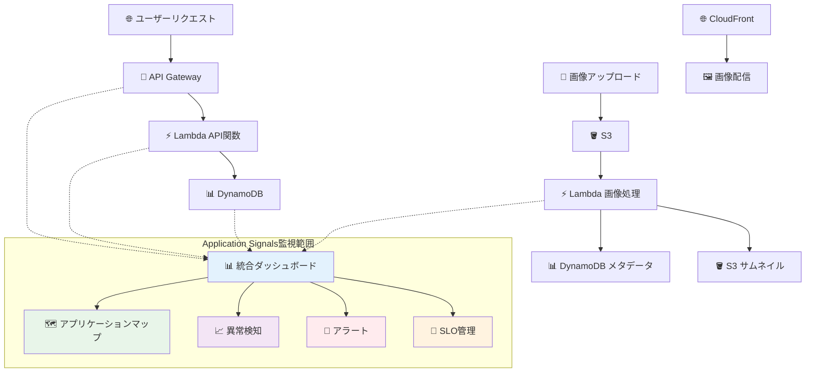
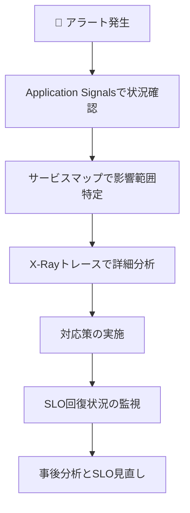
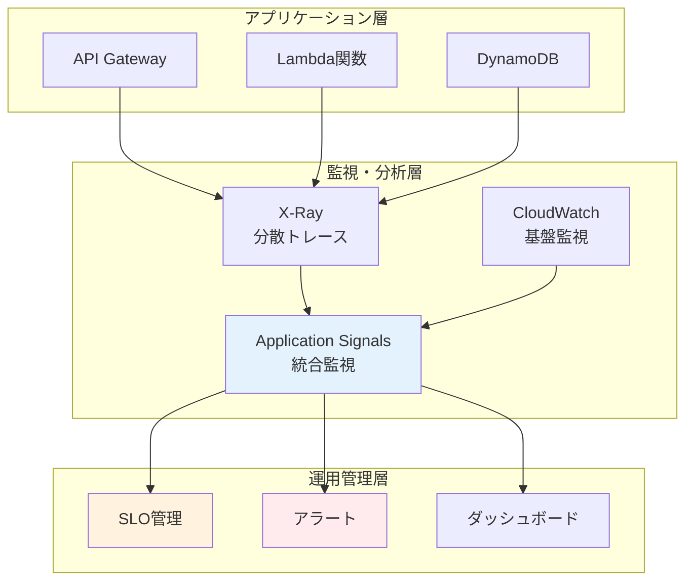

# 📡 Step 12: Application Signals（次世代監視）

## ⏱️ このステップの所要時間
**約15分**

## 🎯 このステップのゴール
- AWS Application Signalsによる統合監視を導入
- アプリケーションレベルのメトリクスとSLI/SLOを設定
- 自動的なアプリケーションマップ生成を体験
- 次世代の統合監視プラットフォームを理解

---

## 💡 AWS Application Signalsとは？

**AWS Application Signals** は、2024年に一般公開された次世代のアプリケーション監視サービスです。

:::info 🌟 Application Signalsの革新的な特徴
- **統合監視**: メトリクス、ログ、トレースを統一ダッシュボードで表示
- **自動検出**: アプリケーション構成を自動的に発見・マップ化
- **SLO管理**: Service Level Objectives の設定と追跡を自動化
- **リアルタイム分析**: 異常検知とアラート機能
- **X-Ray連携**: 分散トレーシングと完全統合
- **コスト効率**: 設定不要で即座に利用開始可能
:::

:::warning 🚧 新サービスについて
Application Signalsは比較的新しいサービスのため、一部リージョンでは利用できない場合があります。東京リージョン（ap-northeast-1）での利用を前提とします。
:::

---

## 🏗️ Application Signals監視範囲



---

## 🔧 Step 12-1: Application Signalsの有効化

### CloudWatch Applicationコンソールへ移動

1. **AWS コンソール** → **「CloudWatch」** を選択
2. 左メニューから **「Application Signals」** をクリック
3. **「開始方法」** または **「アプリケーションを検出」** ボタンをクリック

:::tip 💡 初回アクセス
Application Signalsを初めて使用する場合、サービスの有効化に数分かかる場合があります。
:::

### 自動検出の開始

1. **「自動インストルメンテーションを有効にする」** を選択
2. **対象サービス** で以下にチェック：
   - ✅ **API Gateway**
   - ✅ **AWS Lambda**
   - ✅ **Amazon DynamoDB**

3. **「監視の開始」** をクリック

### 監視対象の確認

設定完了後、数分待つとアプリケーションの自動検出が開始されます：

1. **「サービス」** タブで検出されたサービス一覧を確認
2. あなたのAPI Gateway、Lambda関数、DynamoDBテーブルが表示されることを確認

---

## 📊 Step 12-2: アプリケーションマップの確認

### サービスマップの表示

1. **Application Signals** → **「サービスマップ」** をクリック
2. 自動生成されたアプリケーション構成図を確認

表示される情報例：
```
🌐 API Gateway (2025-tohoku-it-giovanni-image-api)
    ↓ 平均レスポンス時間: 245ms
    ↓ エラー率: 0.5%
⚡ Lambda関数 (2025-tohoku-it-giovanni-api)  
    ↓ 平均実行時間: 180ms
    ↓ 実行成功率: 99.2%
📊 DynamoDB (2025-tohoku-it-giovanni-image-metadata)
    ↓ 平均クエリ時間: 45ms
    ↓ スロットリング: 0件
```

### 詳細メトリクスの確認

各サービスノードをクリックして詳細情報を表示：

1. **パフォーマンスメトリクス**:
   - リクエスト数（RPM）
   - レスポンス時間（P50, P90, P99）
   - エラー率

2. **依存関係**:
   - 上流・下流サービスの特定
   - トラフィックフローの可視化

---

## 🎯 Step 12-3: SLO（Service Level Objective）の設定

### API用SLOの作成

1. **Application Signals** → **「SLO」** → **「SLOを作成」**
2. SLO設定：

```yaml
SLO名: Image API Availability
説明: 画像APIの可用性目標

対象サービス: 
  - API Gateway: 2025-tohoku-it-giovanni-image-api
  - Operation: GET /images

SLI（指標）タイプ: 可用性
目標: 99.5%
期間: 30日間

しきい値:
  - 成功: HTTP 200-299
  - 失敗: HTTP 400-599
```

3. **「SLOを作成」** をクリック

### 画像処理用SLOの作成

1. **「SLOを作成」** → 新しいSLOを作成
2. 設定：

```yaml
SLO名: Image Processing Latency
説明: 画像処理のレスポンス時間目標

対象サービス:
  - Lambda: 2025-tohoku-it-giovanni-image-processor

SLI（指標）タイプ: レイテンシ
目標: 95%のリクエストが3秒以内
期間: 7日間

しきい値: 3000ms（3秒）
```

### SLOダッシュボードの確認

1. **「SLO」** タブで設定したSLOの状況を確認
2. **エラーバジェット** の消費状況をチェック
3. **傾向グラフ** でパフォーマンス推移を分析

---

## 🚨 Step 12-4: アラートの設定

### SLOベースアラートの作成

1. **作成したSLO** を選択 → **「アラートを作成」**
2. アラート設定：

```yaml
アラート名: Image API SLO Breach
説明: 画像APIのSLOが危険レベルに到達

条件:
  - エラーバジェット消費率が80%を超えた場合
  - 評価期間: 5分間

通知先:
  - SNSトピック: （オプション）
  - メール通知: your-email@example.com
```

3. **「アラートを作成」** をクリック

### カスタムメトリクスアラート

1. **CloudWatch** → **「アラーム」** → **「アラームの作成」**
2. メトリクス選択：

```yaml
名前空間: AWS/ApplicationSignals
メトリクス名: Latency.Average
ディメンション:
  - Service: your-lambda-function
  - Operation: invoke
```

3. しきい値設定：
```yaml
しきい値タイプ: 静的
条件: より大きい
しきい値: 2000 (2秒)
データポイント: 2/3 (3評価期間中2回)
```

---

## 🧪 Step 12-5: 監視データの生成とテスト

### APIトラフィックの生成

以下のスクリプトで定期的なAPIアクセスを実行：

```bash
#!/bin/bash
# API負荷テスト用スクリプト

API_URL="https://your-api-gateway-url/prod"

echo "画像API負荷テスト開始..."

# 5分間、10秒間隔でAPIを呼び出し
for i in {1..30}; do
    echo "[$i/30] API呼び出し中..."
    
    # 正常なAPI呼び出し
    curl -s "${API_URL}/images" > /dev/null
    
    # 存在しない画像IDでの呼び出し（エラー生成）
    if [ $((i % 10)) -eq 0 ]; then
        curl -s "${API_URL}/images/nonexistent-id" > /dev/null
        echo "  → エラーケース実行"
    fi
    
    sleep 10
done

echo "負荷テスト完了"
```

### 画像処理トラフィックの生成

1. S3バケットの `uploads/` フォルダに複数の画像をアップロード
2. Lambda関数の自動実行を確認
3. CloudWatch Logsでログ出力を確認

---

## 📊 Step 12-6: 統合ダッシュボードの活用

### カスタムダッシュボードの作成

1. **Application Signals** → **「ダッシュボード」** → **「ダッシュボードを作成」**
2. ダッシュボード設定：

```yaml
ダッシュボード名: 画像処理システム統合監視
説明: ハンズオン画像処理システムの包括的監視

ウィジェット構成:
1. システム概要
   - 全体のリクエスト数
   - 平均レスポンス時間
   - エラー率

2. API Gateway メトリクス
   - エンドポイント別リクエスト数
   - レスポンス時間分布

3. Lambda 処理状況
   - 実行時間傾向
   - エラー発生状況
   - 同時実行数

4. DynamoDB パフォーマンス
   - 読み取り・書き込み容量消費
   - スロットリング状況

5. SLO 達成状況
   - エラーバジェット消費率
   - SLO達成率の推移
```

### リアルタイム監視の設定

1. **「自動更新」** を1分間隔に設定
2. **時間範囲** を直近1時間に設定
3. **アラート状況** パネルを追加

---

## 📈 Step 12-7: 高度な分析機能

### 異常検知の有効化

1. **Application Signals** → **「異常検知」** → **「検出器を作成」**
2. 設定：

```yaml
検出器名: Image Processing Anomaly
対象メトリクス:
  - Lambda Duration (平均実行時間)
  - API Gateway 4XXError
  - DynamoDB ConsumedReadCapacityUnits

感度: 中レベル
学習期間: 7日間
```

### トレンド分析

1. **「分析」** タブで長期的なトレンドを確認
2. **時間範囲** を過去30日間に設定
3. 以下の指標を分析：
   - ピークトラフィック時間帯
   - エラー発生パターン
   - パフォーマンス改善効果

---

## 🔧 トラブルシューティング

### Q: Application Signalsが表示されない

#### 確認ポイント
1. **リージョン**: 東京リージョン（ap-northeast-1）を使用しているか
2. **権限**: CloudWatchFullAccessまたはApplicationSignalsReadOnlyAccess
3. **サービス有効化**: Application Signalsサービスが有効化されているか

### Q: サービスマップにコンポーネントが表示されない

#### 原因と対処
1. **トラフィック不足**: APIを数回呼び出してトラフィックを生成
2. **検出時間**: 初回検出には15-30分程度要する場合がある
3. **設定確認**: 自動インストルメンテーションが有効になっているか

### Q: SLOが計算されない

#### 解決方法
```yaml
必要条件:
- 対象サービスに十分なトラフィックがある
- メトリクスが正常に収集されている  
- SLO設定で正しいサービスを選択している
```

---

## 🚀 実運用での活用方法

### 1. 日常監視のベストプラクティス

```yaml
毎日の確認項目:
□ SLO達成状況をチェック
□ エラーバジェット消費率を確認
□ 異常検知アラートの確認
□ パフォーマンストレンドの分析

週次レビュー:
□ SLO設定の妥当性確認
□ アラートのチューニング
□ 長期トレンドの分析
□ 改善施策の効果測定
```

### 2. インシデント対応フロー



### 3. パフォーマンス改善の指標

Application Signalsで追跡すべきKPI：

```yaml
可用性:
- API成功率: 99.5%以上
- Lambda実行成功率: 99.9%以上

パフォーマンス:
- API P99レスポンス時間: 1秒以内
- 画像処理時間: P95で3秒以内

効率性:
- DynamoDBスロットリング: 0件
- Lambda同時実行制限到達: 0件
```

---

## 🏆 Step 12完了！

:::success 🎉 Application Signals次世代監視の導入完了！

**習得した最新監視技術：**
- ✅ 統合アプリケーション監視の実装
- ✅ 自動サービス検出と依存関係マップ
- ✅ SLI/SLO管理による品質保証
- ✅ リアルタイム異常検知システム
- ✅ 次世代監視プラットフォームの活用

**構築した監視システム：**
- 📡 統合ダッシュボードによる一元管理
- 🎯 SLOベースの品質管理
- 🚨 プロアクティブなアラート機能
- 📊 自動化されたパフォーマンス分析
- 🗺️ リアルタイムアプリケーションマップ
:::

### 📚 このステップで学んだ次世代技術

1. **統合監視の新しいアプローチ**
   - メトリクス、ログ、トレースの統合表示
   - 自動化されたサービス検出

2. **SRE（Site Reliability Engineering）実践**
   - SLI/SLO による品質定義
   - エラーバジェット管理

3. **運用効率化の実現**
   - 設定レス監視の実現
   - インテリジェントアラート機能

---

<div style={{textAlign: 'center', marginTop: '2rem', fontSize: '1.2em'}}>

[**← 前へ: Step 11 - X-Ray分散トレース**](./11-xray-extension) | [**次へ: Step 13 - WebP拡張機能 →**](./13-webp-extension)

</div>

## 🌟 総括：完全な監視エコシステムの構築

Step 10-12を通じて、以下の包括的な監視システムが完成しました：



この統合監視システムにより、エンタープライズレベルの運用品質を実現できます！