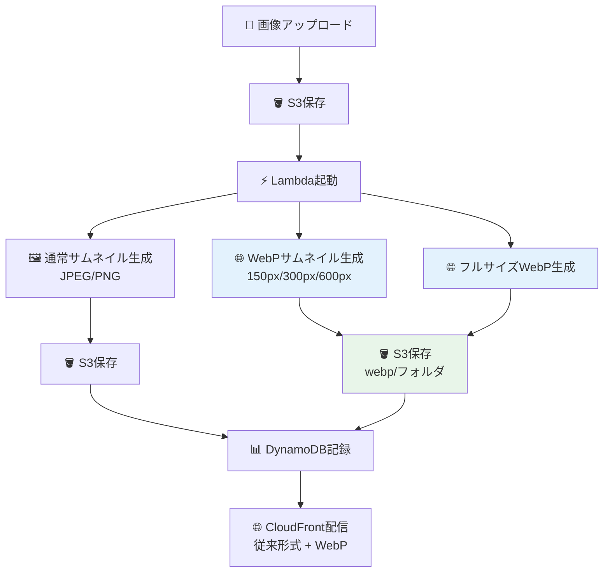

# 🚀 Step 13: WebP拡張機能（上級者向け）

## ⏱️ このステップの所要時間
**約20分**

## 🎯 このステップのゴール
- WebP形式による30-50%のファイルサイズ削減を実現
- 既存のLambda関数を拡張してWebP変換機能を追加
- モダンな画像形式への対応技術を習得

---

## 💡 WebPとは？

**WebP** は、Googleが開発した次世代の画像形式で、従来のJPEGやPNGと比べて大幅なファイルサイズ削減を実現します。

:::info 🌟 WebPの利点
- **ファイルサイズ**: JPEGより30-35%小さく
- **透明度対応**: PNGより25-35%小さく
- **品質**: 視覚的品質を保ったまま圧縮
- **ブラウザ対応**: Chrome、Firefox、Safari、Edge全てで対応
:::

### 実際のファイルサイズ比較

| 画像形式 | ファイルサイズ | 削減率 |
|---------|---------------|--------|
| JPEG (元画像) | 234 KB | - |
| WebP (同品質) | 156 KB | **33%削減** |
| PNG (元画像) | 892 KB | - |
| WebP (同品質) | 567 KB | **36%削減** |

---

## 🏗️ WebP処理システムの全体像



---

## 🔧 Step 9-1: Lambda関数の拡張

### 既存Lambda関数のバックアップ

まず、現在のLambda関数をバックアップします：

1. Lambda関数の **「コード」** タブを開く
2. 現在の`lambda_function.py`の全てのコードをコピー
3. ローカルに「`lambda_function_backup.py`」として保存

:::tip 💾 バックアップの重要性
現在のLambda関数は正常に動作しているため、WebP拡張で問題が発生した場合に備えて必ずバックアップしてください。
:::

### WebP処理機能の追加

既存のLambda関数に以下の修正を行います：

#### 修正箇所1: WebPフォルダのスキップ処理追加

**現在のスキップ処理（約18行目付近）を修正：**

```python
# 修正前
        # サムネイル画像の場合は処理をスキップ（無限ループ防止）
        if key.startswith('thumbnails/'):

# 修正後
        # サムネイルやWebP画像の場合は処理をスキップ（無限ループ防止）
        if key.startswith(('thumbnails/', 'webp/')):
            print(f"処理済み画像のためスキップ: {key}")
```

#### 修正箇所2: WebPサムネイル生成機能の追加

**既存のサムネイル生成ループの後（約200行目付近）に追加：**

```python
        # 🆕 WebP形式でのサムネイル作成
        print("🌍 WebPサムネイル生成開始")
        for size_name, size_px in thumbnail_sizes.items():
            print(f"WebPサムネイル生成中: {size_name} ({size_px}px)")
            
            # サムネイル作成（アスペクト比を維持）
            webp_thumbnail = image.copy()
            webp_thumbnail.thumbnail((size_px, size_px), Image.Resampling.LANCZOS)
            
            # メモリ上でWebPとして保存
            webp_buffer = io.BytesIO()
            webp_thumbnail.save(webp_buffer, format='WEBP', quality=80, method=6)
            webp_data = webp_buffer.getvalue()
            webp_buffer.seek(0)
            
            # WebPサムネイル用のキーを生成
            clean_key = key[8:] if key.startswith('uploads/') else key
            base_name = clean_key.rsplit('.', 1)[0] if '.' in clean_key else clean_key
            webp_key = f"webp/{base_name}_{size_name}.webp"
            
            s3.put_object(
                Bucket=bucket,
                Key=webp_key,
                Body=webp_data,
                ContentType='image/webp'
            )
            
            # DynamoDB用のサムネイル情報を記録
            processed_images.append({
                "key": webp_key,
                "size": size_name,
                "width": webp_thumbnail.width,
                "height": webp_thumbnail.height,
                "file_size": len(webp_data),
                "format": "WEBP"
            })
            
            print(f"✅ {size_name}WebPサムネイル保存完了: {webp_key}")
        
        # 🆕 フルサイズのWebP変換
        print("🖼️ フルサイズWebP変換開始")
        full_webp_buffer = io.BytesIO()
        image.save(full_webp_buffer, format='WEBP', quality=80, method=6)
        full_webp_data = full_webp_buffer.getvalue()
        
        # フルサイズWebP用のキーを生成
        full_webp_key = f"webp/{base_name}.webp"
        
        s3.put_object(
            Bucket=bucket,
            Key=full_webp_key,
            Body=full_webp_data,
            ContentType='image/webp'
        )
        
        # DynamoDB用の情報を記録
        processed_images.append({
            "key": full_webp_key,
            "size": "full",
            "width": image.width,
            "height": image.height,
            "file_size": len(full_webp_data),
            "format": "WEBP"
        })
        
        print(f"✅ フルサイズWebP保存完了: {full_webp_key}")
```

#### 修正箇所3: 既存関数の確認

**現在のLambda関数はシンプルな単一関数構造です。新しい関数の追加は不要で、既存のメインループ内に直接WebP処理を追加します。**

:::info 📝 現在の構造について
現在のLambda関数は：
- 単一の`lambda_handler`関数内ですべての処理を実行
- サムネイルパス: `thumbnails/ファイル名_サイズ.jpg`
- シンプルで理解しやすい構造
:::

#### 修正箇所4: 最終確認

**現在のシンプルな構造では、新しい関数の追加は不要です。上記の修正で2ですべてのWebP処理が完結します。**

:::success ✨ シンプルなアプローチの利点
- 既存コードを最小限の変更で拡張
- 理解しやすいシンプルな構造を維持
- デバッグやメンテナンスが容易
:::

---

## 📤 Step 9-2: Lambda関数の更新

### コードの反映

1. 修正したコードをLambda関数エディタに貼り付け
2. **「Deploy」** ボタンをクリック
3. デプロイ完了を確認

### タイムアウト設定の調整

WebP処理により処理時間が増加するため設定を調整：

1. **「設定」** → **「一般設定」** → **「編集」**
2. **タイムアウト**: `10分 0秒` に変更
3. **メモリ**: `1024 MB` に変更（推奨）

---

## 🧪 Step 9-3: WebP機能のテスト

### テスト画像のアップロード

1. S3バケットに新しい画像をアップロード
2. Lambda関数が実行されることを確認

### 生成結果の確認

正常に処理された場合、以下のファイル構造が作成されます：

```
your-bucket/
├── uploads/                     # アップロードフォルダ
│   └── forest.jpg               # 元画像
├── thumbnails/                 # 従来のサムネイル
│   ├── forest_small.jpg
│   ├── forest_medium.jpg
│   └── forest_large.jpg
└── webp/                       # 🆕 WebPバージョン
    ├── forest_small.webp
    ├── forest_medium.webp
    ├── forest_large.webp
    └── forest.webp              # フルサイズ
```

### ファイルサイズ比較

1. S3コンソールで各ファイルのサイズを確認
2. 従来形式とWebPのファイルサイズを比較
3. 30-50%の削減効果を確認

**期待される結果例：**
- JPEG 150px: 8 KB → WebP: 5 KB（37%削減）
- JPEG 300px: 25 KB → WebP: 16 KB（36%削減）
- JPEG 600px: 85 KB → WebP: 55 KB（35%削減）

---

## 🌐 Step 9-4: CloudFront配信の確認

### WebP画像への直接アクセス

CloudFrontドメインを使用してWebP画像にアクセス：

```
# サムネイル
https://your-cloudfront-domain.cloudfront.net/webp/forest_medium.webp

# フルサイズ
https://your-cloudfront-domain.cloudfront.net/webp/forest.webp
```

### ブラウザでの表示確認

1. Chrome、Firefox、Safari、Edgeで画像が正常に表示されることを確認
2. 開発者ツールのNetworkタブでファイルサイズを確認
3. 従来のJPEG/PNG版と比較

---

## 📊 Step 9-5: DynamoDBデータの確認

### 拡張されたメタデータ構造

WebP機能を追加した場合のDynamoDBレコード例：

```json
{
  "image_id": "dc925a02-06f1-49e3-9895-3c3f1797a584",
  "upload_time": "2025-01-15T10:30:45.123Z",
  "original_image": {
    "key": "uploads/forest.jpg",
    "width": 1920,
    "height": 1080,
    "file_size": 234567,
    "format": "JPEG"
  },
  "processed_images": [
    {
      "key": "thumbnails/forest_small.jpg",
      "size": "small",
      "width": 150,
      "height": 84,
      "file_size": 8192,
      "format": "JPEG"
    },
    {
      "key": "webp/forest_small.webp",
      "size": "small", 
      "width": 150,
      "height": 84,
      "file_size": 5234,
      "format": "WEBP"
    },
    {
      "key": "webp/forest.webp",
      "size": "full", 
      "width": 1920,
      "height": 1080,
      "file_size": 156789,
      "format": "WEBP"
    }
  ]
}
```

---

## 📝 修正後のLambda関数完全版

以下が、WebP機能を追加した完全なLambda関数のコードです：

```python
import json
import boto3
import os
from datetime import datetime
from urllib.parse import unquote_plus
import uuid
from PIL import Image
import io

# AWSサービスのクライアント初期化
s3 = boto3.client('s3')
dynamodb = boto3.resource('dynamodb')
table = dynamodb.Table(os.environ['TABLE_NAME'])

def lambda_handler(event, context):
    """
    S3にアップロードされた画像を処理するメイン関数
    1. 画像をダウンロード
    2. 3つのサイズでサムネイル作成（JPEG + WebP）
    3. サムネイルをS3に保存
    4. メタデータをDynamoDBに記録
    """
    try:
        # S3イベントから情報を取得
        record = event['Records'][0]
        bucket = record['s3']['bucket']['name']
        key = unquote_plus(record['s3']['object']['key'])
        
        # サムネイルやWebP画像の場合は処理をスキップ（無限ループ防止）
        if key.startswith(('thumbnails/', 'webp/')):
            print(f"処理済み画像のためスキップ: {key}")
            return {
                'statusCode': 200,
                'body': json.dumps({
                    'message': 'サムネイル画像は処理対象外です',
                    'skipped_key': key
                }, ensure_ascii=False)
            }
        
        print(f"処理開始: {bucket}/{key}")
        
        # オリジナル画像をS3からダウンロード
        response = s3.get_object(Bucket=bucket, Key=key)
        image_content = response['Body'].read()
        content_type = response.get('ContentType', 'image/jpeg')
        
        # PILで画像を開く
        image = Image.open(io.BytesIO(image_content))
        original_format = image.format or 'JPEG'
        
        # RGBA形式の場合はRGBに変換（JPEG保存用）
        if image.mode in ('RGBA', 'LA', 'P'):
            # 白背景を作成
            rgb_image = Image.new('RGB', image.size, (255, 255, 255))
            # アルファチャンネルがある場合は合成
            if image.mode == 'RGBA' or image.mode == 'LA':
                rgb_image.paste(image, mask=image.split()[-1])
            else:
                rgb_image.paste(image)
            image = rgb_image
        
        # サムネイルサイズの定義
        thumbnail_sizes = {
            'small': 150,
            'medium': 300,
            'large': 600
        }
        
        # 生成したサムネイル情報を格納
        processed_images = []
        
        # uploads/プレフィックスを除去してベース名を取得
        clean_key = key[8:] if key.startswith('uploads/') else key
        base_name = clean_key.rsplit('.', 1)[0] if '.' in clean_key else clean_key
        
        # 🖼️ 従来のJPEGサムネイルを生成
        print("📸 JPEG サムネイル生成開始")
        for size_name, size_px in thumbnail_sizes.items():
            print(f"サムネイル生成中: {size_name} ({size_px}px)")
            
            # サムネイル作成（アスペクト比を維持）
            thumbnail = image.copy()
            thumbnail.thumbnail((size_px, size_px), Image.Resampling.LANCZOS)
            
            # メモリ上でJPEGとして保存
            output_buffer = io.BytesIO()
            thumbnail.save(output_buffer, format='JPEG', quality=85, optimize=True)
            thumbnail_data = output_buffer.getvalue()
            output_buffer.seek(0)
            
            # サイズをファイル名に含める
            thumbnail_key = f"thumbnails/{base_name}_{size_name}.jpg"
            
            s3.put_object(
                Bucket=bucket,
                Key=thumbnail_key,
                Body=thumbnail_data,
                ContentType='image/jpeg'
            )
            
            # DynamoDB用のサムネイル情報を記録
            processed_images.append({
                "key": thumbnail_key,
                "size": size_name,
                "width": thumbnail.width,
                "height": thumbnail.height,
                "file_size": len(thumbnail_data),
                "format": "JPEG"
            })
            
            print(f"✓ {size_name}サムネイル保存完了: {thumbnail_key}")
        
        # 🌐 WebPサムネイルを生成
        print("🌍 WebP サムネイル生成開始")
        for size_name, size_px in thumbnail_sizes.items():
            print(f"WebPサムネイル生成中: {size_name} ({size_px}px)")
            
            # サムネイル作成（アスペクト比を維持）
            webp_thumbnail = image.copy()
            webp_thumbnail.thumbnail((size_px, size_px), Image.Resampling.LANCZOS)
            
            # メモリ上でWebPとして保存
            webp_buffer = io.BytesIO()
            webp_thumbnail.save(webp_buffer, format='WEBP', quality=80, method=6)
            webp_data = webp_buffer.getvalue()
            webp_buffer.seek(0)
            
            # WebPサムネイル用のキーを生成
            webp_key = f"webp/{base_name}_{size_name}.webp"
            
            s3.put_object(
                Bucket=bucket,
                Key=webp_key,
                Body=webp_data,
                ContentType='image/webp'
            )
            
            # DynamoDB用のサムネイル情報を記録
            processed_images.append({
                "key": webp_key,
                "size": size_name,
                "width": webp_thumbnail.width,
                "height": webp_thumbnail.height,
                "file_size": len(webp_data),
                "format": "WEBP"
            })
            
            print(f"✅ {size_name}WebPサムネイル保存完了: {webp_key}")
        
        # 🖼️ フルサイズのWebP変換
        print("🖼️ フルサイズWebP変換開始")
        full_webp_buffer = io.BytesIO()
        image.save(full_webp_buffer, format='WEBP', quality=80, method=6)
        full_webp_data = full_webp_buffer.getvalue()
        
        # フルサイズWebP用のキーを生成
        full_webp_key = f"webp/{base_name}.webp"
        
        s3.put_object(
            Bucket=bucket,
            Key=full_webp_key,
            Body=full_webp_data,
            ContentType='image/webp'
        )
        
        # DynamoDB用の情報を記録
        processed_images.append({
            "key": full_webp_key,
            "size": "full",
            "width": image.width,
            "height": image.height,
            "file_size": len(full_webp_data),
            "format": "WEBP"
        })
        
        print(f"✅ フルサイズWebP保存完了: {full_webp_key}")
        
        # DynamoDBにメタデータを保存
        image_id = str(uuid.uuid4())
        current_time = datetime.now().strftime("%Y-%m-%dT%H:%M:%S.%fZ")
        
        item = {
            'image_id': image_id,
            'upload_time': current_time,
            'original_image': {
                'key': key,
                'width': image.width,
                'height': image.height,
                'file_size': len(image_content),
                'format': original_format
            },
            'processed_images': processed_images
        }
        
        table.put_item(Item=item)
        print(f"✓ DynamoDBへの保存完了: {image_id}")
        
        # 成功レスポンス
        return {
            'statusCode': 200,
            'body': json.dumps({
                'message': '画像処理（JPEG + WebP）が正常に完了しました',
                'image_id': image_id,
                'original_key': key,
                'thumbnails_created': len([img for img in processed_images if img['format'] == 'JPEG']),
                'webp_created': len([img for img in processed_images if img['format'] == 'WEBP'])
            }, ensure_ascii=False)
        }
        
    except Exception as e:
        print(f"エラー発生: {str(e)}")
        import traceback
        traceback.print_exc()
        
        # エラー情報をDynamoDBに記録
        try:
            error_item = {
                'image_id': str(uuid.uuid4()),
                'upload_time': datetime.now().strftime("%Y-%m-%dT%H:%M:%S.%fZ"),
                'original_image': {
                    'key': key if 'key' in locals() else 'unknown',
                    'width': 0,
                    'height': 0,
                    'file_size': 0,
                    'format': 'UNKNOWN'
                },
                'processed_images': [],
                'error_message': str(e)
            }
            table.put_item(Item=error_item)
        except Exception as db_error:
            print(f"DynamoDBエラー記録も失敗: {str(db_error)}")
        
        # エラーレスポンス
        return {
            'statusCode': 500,
            'body': json.dumps({
                'error': '画像処理中にエラーが発生しました',
                'details': str(e)
            }, ensure_ascii=False)
        }
```

:::tip 💡 コードの主な変更点
- **スキップ処理拡張**: `thumbnails/` と `webp/` の両方をスキップ
- **WebPサムネイル生成**: JPEG生成後にWebP版を追加生成
- **フルサイズWebP**: 元画像サイズでのWebP変換
- **DynamoDB統合**: JPEG と WebP の両方の情報を統一して記録
- **詳細ログ**: 処理状況を段階的に出力
- **エラー処理**: 既存のエラー処理を維持
:::

---

## 🚨 トラブルシューティング

### Q: WebP画像が生成されない

#### 症状
従来のサムネイルは作成されるが、WebP版が作成されない

#### 解決方法
1. **CloudWatch Logs**を確認
2. **メモリ不足**の場合：メモリを1024MBに増加
3. **タイムアウト**の場合：タイムアウトを10分に設定
4. **PIL/Pillowライブラリ**の確認

### Q: WebP画像のファイルサイズが期待より大きい

#### 原因と対処
- **品質設定**：`quality=80` → `quality=70` に下げる
- **method設定**：`method=6`（最高圧縮）を確認
- **元画像の特徴**：複雑な画像ではWebPの効果が限定的

### Q: ブラウザでWebP画像が表示されない

#### 確認点
- **ブラウザ対応**：古いブラウザでは非対応
- **MIMEタイプ**：`image/webp`が正しく設定されているか
- **CloudFront設定**：WebPファイルのキャッシュ設定

---

## 📈 パフォーマンス最適化のヒント

### 1. 条件付きWebP配信

```javascript
// フロントエンドでのWebP対応判定
function supportsWebP() {
    return new Promise((resolve) => {
        const webP = new Image();
        webP.onload = webP.onerror = function () {
            resolve(webP.height === 2);
        };
        webP.src = 'data:image/webp;base64,UklGRjoAAABXRUJQVlA4IC4AAACyAgCdASoCAAIALmk0mk0iIiIiIgBoSygABc6WWgAA/veff/0PP8bA//LwYAAA';
    });
}

// WebP対応ブラウザには WebP、非対応には JPEG/PNG
supportsWebP().then(supported => {
    const imageUrl = supported 
        ? 'https://cdn.example.com/webp/medium/image.webp'
        : 'https://cdn.example.com/thumbnails/medium/image.jpg';
});
```

### 2. 段階的なWebP導入

1. **Phase 1**: 新規画像のみWebP生成
2. **Phase 2**: 既存画像の段階的WebP変換
3. **Phase 3**: フロントエンドでの自動WebP配信

---

## 🏆 Step 13完了！

:::success 🎉 WebP拡張機能の実装完了！

**習得した高度なスキル：**
- ✅ WebP形式による画像最適化
- ✅ Lambda関数の段階的機能拡張
- ✅ 条件分岐による複数形式の同時生成
- ✅ モダンな画像配信技術の実装
- ✅ パフォーマンス最適化の実践

**削減効果：**
- 平均 30-50% のファイルサイズ削減
- 高速な画像読み込み
- 帯域幅とストレージコストの最適化
:::

### 📚 このステップで学んだ先進技術

1. **次世代画像形式の活用**
   - WebP の圧縮技術とアルゴリズム
   - 品質と圧縮率のバランス調整

2. **条件付き処理の実装**
   - 同一関数での複数形式サポート
   - 効率的な分岐処理

3. **エンタープライズ対応**
   - 段階的機能追加の手法
   - バックワード互換性の保持

---

<div style={{textAlign: 'center', marginTop: '2rem', fontSize: '1.2em'}}>

[**← 前へ: Step 12 - Application Signals**](./12-application-signals-extension) | [**📋 ハンズオン概要に戻る**](./)

</div>