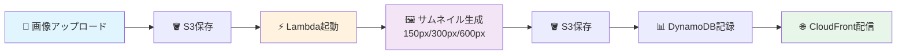

# 🏔️ 東北IT物産展2025 - AWS画像処理ハンズオン

## 🌾 東北の技術者が集まるハンズオンへようこそ！

## 📋 本日のゴール

**2時間で、実際に本番環境で使える画像処理システムを構築します！**

画像をアップロードすると自動的に3つのサイズのサムネイルを作成し、世界中に高速配信するシステムを作ります。

## 🏗️ 構築するシステムの全体像



## 🎯 このハンズオンで学べること

### 技術スキル
- ✅ **S3**: オブジェクトストレージの基本操作とイベント設定
- ✅ **Lambda**: サーバーレス関数の作成とデプロイ
- ✅ **DynamoDB**: NoSQLデータベースの構築と操作
- ✅ **CloudFront**: CDNによる高速配信の設定
- ✅ **IAM**: AWSの権限管理の基礎

### 実践的なノウハウ
- 📌 本番環境で使えるエラーハンドリング
- 📌 コスト最適化のベストプラクティス
- 📌 セキュリティを考慮した設計
- 📌 トラブルシューティングの方法

## 📚 ハンズオンの流れ

各ステップの所要時間と内容：

| Step | 内容 | 時間 |
|------|------|------|
| **準備** | 環境確認・ログイン | 5分 |
| **Step 1** | S3バケット作成 | 10分 |
| **Step 2** | DynamoDBテーブル作成 | 10分 |
| **Step 3** | Lambda関数作成 | 15分 |
| **Step 4** | S3イベント設定 | 10分 |
| **Step 5** | CloudFront設定 | 15分 |
| **Step 6** | システムテスト | 10分 |
| **後片付け** | リソースのクリーンアップ | 5分 |

:::tip 🏔️ 東北IT物産展ならではの学び方
- **みんなで一緒に**: 困ったときはお隣の参加者と相談し合いましょう
- **地域コミュニティ**: ハンズオン後も東北のIT仲間として交流を続けましょう
- **実践重視**: 今日学んだ技術を、東北の地域課題解決にも活かしていきましょう
:::

## 🔧 必要なもの

### 配布済み（確認してください）
- [ ] **AWSアカウント情報**（ユーザー名、Access Key、Secret Key）
- [ ] **サンプル画像**へのアクセス権限

### ご用意いただくもの
- [ ] **ブラウザ**（Chrome、Firefox、Safari推奨）
- [ ] **テキストエディタ**（メモ帳でもOK）
- [ ] **メモを取るもの**（重要な情報を控えるため）

## 📝 あなたの情報を確認

配布資料から以下の情報を確認し、メモしておいてください：

:::caution 重要
この情報は後のステップで何度も使用します。必ずメモを取っておいてください。
:::

```yaml
ユーザー名: 2025-tohoku-it-[あなたの名前]
例: 2025-tohoku-it-giovanni

Access Key ID: AKIA...（配布資料参照）
Secret Access Key: ...（配布資料参照）
リージョン: ap-northeast-1（東京）
```

## 🚦 準備はできましたか？

以下のチェックリストを確認してください：

- [ ] 配布資料を手元に用意した
- [ ] ユーザー名を確認した
- [ ] Access Key IDとSecret Access Keyをメモした
- [ ] ブラウザを起動した
- [ ] 集中できる環境が整った

:::success 🎉 準備完了！
すべてチェックできたら、次のページ「事前準備・環境確認」に進みましょう！
:::

## ⚠️ 注意事項

### セキュリティについて
- Access KeyとSecret Keyは**絶対に他人に教えない**でください
- ハンズオン終了後は必ず**ログアウト**してください
- 作成したリソースは最後に**削除**します（課金防止）

### 進行について
- わからないことがあれば**すぐに質問**してください
- 他の参加者より早く終わっても、次のステップの開始は**全員で合わせます**
- エラーが出ても慌てずに、**エラーメッセージを読んで**対処しましょう

---

<div style={{textAlign: 'center', marginTop: '2rem'}}>

**それでは、AWS画像処理システムの構築を始めましょう！** 🚀

[**次へ: 事前準備・環境確認 →**](./preparation)

</div>