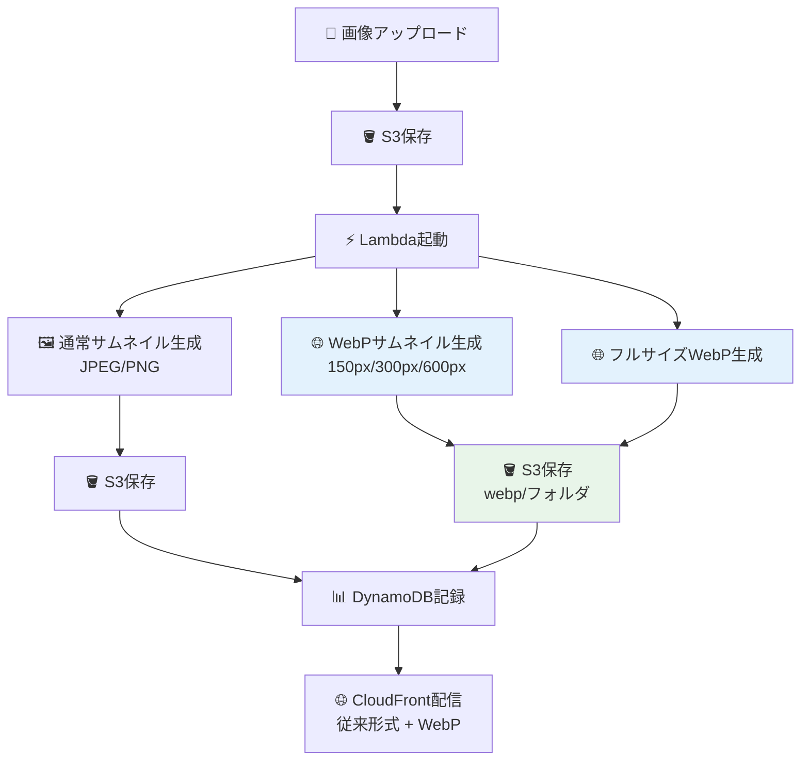

# 🚀 Step 9: WebP拡張機能（上級者向け）

## ⏱️ このステップの所要時間
**約20分**

## 🎯 このステップのゴール
- WebP形式による30-50%のファイルサイズ削減を実現
- 既存のLambda関数を拡張してWebP変換機能を追加
- モダンな画像形式への対応技術を習得

---

## 💡 WebPとは？

**WebP** は、Googleが開発した次世代の画像形式で、従来のJPEGやPNGと比べて大幅なファイルサイズ削減を実現します。

:::info 🌟 WebPの利点
- **ファイルサイズ**: JPEGより30-35%小さく
- **透明度対応**: PNGより25-35%小さく
- **品質**: 視覚的品質を保ったまま圧縮
- **ブラウザ対応**: Chrome、Firefox、Safari、Edge全てで対応
:::

### 実際のファイルサイズ比較

| 画像形式 | ファイルサイズ | 削減率 |
|---------|---------------|--------|
| JPEG (元画像) | 234 KB | - |
| WebP (同品質) | 156 KB | **33%削減** |
| PNG (元画像) | 892 KB | - |
| WebP (同品質) | 567 KB | **36%削減** |

---

## 🏗️ WebP処理システムの全体像



---

## 🔧 Step 9-1: Lambda関数の拡張

### 既存Lambda関数のバックアップ

まず、現在のLambda関数をバックアップします：

1. Lambda関数の **「コード」** タブを開く
2. 全てのコードをコピーして、テキストファイルに保存
3. 「`lambda_function_backup.py`」として保存

### WebP処理機能の追加

既存のLambda関数に以下の修正を行います：

#### 修正箇所1: 処理済みプレフィックスの追加

**20行目付近の `processed_prefixes` 配列を修正：**

```python
# 修正前
processed_prefixes = [
    'thumbnails/',
    'resized/',
    'processed/'
]

# 修正後
processed_prefixes = [
    'thumbnails/',
    'resized/',
    'processed/',
    'webp/'  # 🆕 WebP変換済みもスキップ
]
```

#### 修正箇所2: WebP変換機能の追加

**78行目付近の既存サムネイル作成後に追加：**

```python
# 既存のfor文の後に以下を追加
        # 🆕 WebP形式でのサムネイル作成
        for thumb_config in thumbnail_sizes:
            webp_image = create_thumbnail(
                image, 
                object_key, 
                thumb_config,
                original_format,
                convert_to_webp=True  # WebP変換
            )
            
            # S3にアップロード
            upload_result = upload_to_s3(
                bucket_name, 
                webp_image['key'], 
                webp_image['content']
            )
            
            if upload_result:
                processed_images.append(webp_image)
                logger.info(f"Created WebP thumbnail: {webp_image['key']}")
        
        # 🆕 元画像のWebP変換（フルサイズ）
        full_webp_image = create_webp_version(image, object_key)
        upload_result = upload_to_s3(
            bucket_name,
            full_webp_image['key'],
            full_webp_image['content']
        )
        
        if upload_result:
            processed_images.append(full_webp_image)
            logger.info(f"Created full-size WebP: {full_webp_image['key']}")
```

#### 修正箇所3: create_thumbnail関数の拡張

**関数定義（130行目付近）を修正：**

```python
# 修正前
def create_thumbnail(image, original_key, config, original_format):

# 修正後
def create_thumbnail(image, original_key, config, original_format, convert_to_webp=False):
```

**ファイル名生成部分（138行目付近）を修正：**

```python
# 修正前
    # ファイル名生成
    name_parts = original_key.rsplit('.', 1)
    base_name = name_parts[0]
    extension = name_parts[1] if len(name_parts) > 1 else 'jpg'
    
    thumbnail_key = f"thumbnails/{config['size']}/{base_name}_thumb.{extension.lower()}"

# 修正後
    # ファイル名生成
    name_parts = original_key.rsplit('.', 1)
    base_name = name_parts[0]
    
    if convert_to_webp:
        thumbnail_key = f"webp/{config['size']}/{base_name}_thumb.webp"
        output_format = 'WEBP'
    else:
        extension = name_parts[1] if len(name_parts) > 1 else 'jpg'
        thumbnail_key = f"thumbnails/{config['size']}/{base_name}_thumb.{extension.lower()}"
        output_format = original_format
```

**画像保存部分（150行目付近）を修正：**

```python
# 修正前
    # 画像を指定形式で保存
    buffer = io.BytesIO()
    resized_image.save(buffer, format=original_format, quality=85, optimize=True)

# 修正後
    # 画像を指定形式で保存
    buffer = io.BytesIO()
    if convert_to_webp:
        resized_image.save(buffer, format='WEBP', quality=80, method=6)
    else:
        resized_image.save(buffer, format=original_format, quality=85, optimize=True)
```

#### 修正箇所4: フルサイズWebP変換関数の追加

**ファイルの最後（220行目付近）に新しい関数を追加：**

```python
def create_webp_version(image, original_key):
    """
    元画像のWebPバージョンを作成
    """
    try:
        # ファイル名生成
        name_parts = original_key.rsplit('.', 1)
        base_name = name_parts[0]
        webp_key = f"webp/full/{base_name}.webp"
        
        # WebP形式で保存
        buffer = io.BytesIO()
        image.save(buffer, format='WEBP', quality=80, method=6)
        buffer.seek(0)
        
        # 画像サイズ取得
        width, height = image.size
        file_size = len(buffer.getvalue())
        
        return {
            'key': webp_key,
            'content': buffer.getvalue(),
            'size': 'full',
            'width': width,
            'height': height,
            'file_size': file_size,
            'format': 'WEBP'
        }
        
    except Exception as e:
        logger.error(f"Error creating WebP version: {str(e)}")
        return None
```

---

## 📤 Step 9-2: Lambda関数の更新

### コードの反映

1. 修正したコードをLambda関数エディタに貼り付け
2. **「Deploy」** ボタンをクリック
3. デプロイ完了を確認

### タイムアウト設定の調整

WebP処理により処理時間が増加するため設定を調整：

1. **「設定」** → **「一般設定」** → **「編集」**
2. **タイムアウト**: `10分 0秒` に変更
3. **メモリ**: `1024 MB` に変更（推奨）

---

## 🧪 Step 9-3: WebP機能のテスト

### テスト画像のアップロード

1. S3バケットに新しい画像をアップロード
2. Lambda関数が実行されることを確認

### 生成結果の確認

正常に処理された場合、以下のファイル構造が作成されます：

```
your-bucket/
├── original-image.jpg          # 元画像
├── thumbnails/                 # 従来のサムネイル
│   ├── small/original-image_thumb.jpg
│   ├── medium/original-image_thumb.jpg
│   └── large/original-image_thumb.jpg
└── webp/                       # 🆕 WebPバージョン
    ├── small/original-image_thumb.webp
    ├── medium/original-image_thumb.webp
    ├── large/original-image_thumb.webp
    └── full/original-image.webp
```

### ファイルサイズ比較

1. S3コンソールで各ファイルのサイズを確認
2. 従来形式とWebPのファイルサイズを比較
3. 30-50%の削減効果を確認

**期待される結果例：**
- JPEG 150px: 8 KB → WebP: 5 KB（37%削減）
- JPEG 300px: 25 KB → WebP: 16 KB（36%削減）
- JPEG 600px: 85 KB → WebP: 55 KB（35%削減）

---

## 🌐 Step 9-4: CloudFront配信の確認

### WebP画像への直接アクセス

CloudFrontドメインを使用してWebP画像にアクセス：

```
https://your-cloudfront-domain.cloudfront.net/webp/medium/sample_thumb.webp
```

### ブラウザでの表示確認

1. Chrome、Firefox、Safari、Edgeで画像が正常に表示されることを確認
2. 開発者ツールのNetworkタブでファイルサイズを確認
3. 従来のJPEG/PNG版と比較

---

## 📊 Step 9-5: DynamoDBデータの確認

### 拡張されたメタデータ構造

WebP機能を追加した場合のDynamoDBレコード例：

```json
{
  "image_id": "sample_123.jpg",
  "upload_time": "2025-01-15T10:30:45.123Z",
  "original_image": {
    "key": "sample.jpg",
    "width": 1920,
    "height": 1080,
    "file_size": 234567,
    "format": "JPEG"
  },
  "processed_images": [
    {
      "key": "thumbnails/small/sample_thumb.jpg",
      "size": "small",
      "width": 150,
      "height": 84,
      "file_size": 8192,
      "format": "JPEG"
    },
    {
      "key": "webp/small/sample_thumb.webp",
      "size": "small", 
      "width": 150,
      "height": 84,
      "file_size": 5234,
      "format": "WEBP"
    }
  ]
}
```

---

## 🚨 トラブルシューティング

### Q: WebP画像が生成されない

#### 症状
従来のサムネイルは作成されるが、WebP版が作成されない

#### 解決方法
1. **CloudWatch Logs**を確認
2. **メモリ不足**の場合：メモリを1024MBに増加
3. **タイムアウト**の場合：タイムアウトを10分に設定
4. **PIL/Pillowライブラリ**の確認

### Q: WebP画像のファイルサイズが期待より大きい

#### 原因と対処
- **品質設定**：`quality=80` → `quality=70` に下げる
- **method設定**：`method=6`（最高圧縮）を確認
- **元画像の特徴**：複雑な画像ではWebPの効果が限定的

### Q: ブラウザでWebP画像が表示されない

#### 確認点
- **ブラウザ対応**：古いブラウザでは非対応
- **MIMEタイプ**：`image/webp`が正しく設定されているか
- **CloudFront設定**：WebPファイルのキャッシュ設定

---

## 📈 パフォーマンス最適化のヒント

### 1. 条件付きWebP配信

```javascript
// フロントエンドでのWebP対応判定
function supportsWebP() {
    return new Promise((resolve) => {
        const webP = new Image();
        webP.onload = webP.onerror = function () {
            resolve(webP.height === 2);
        };
        webP.src = 'data:image/webp;base64,UklGRjoAAABXRUJQVlA4IC4AAACyAgCdASoCAAIALmk0mk0iIiIiIgBoSygABc6WWgAA/veff/0PP8bA//LwYAAA';
    });
}

// WebP対応ブラウザには WebP、非対応には JPEG/PNG
supportsWebP().then(supported => {
    const imageUrl = supported 
        ? 'https://cdn.example.com/webp/medium/image.webp'
        : 'https://cdn.example.com/thumbnails/medium/image.jpg';
});
```

### 2. 段階的なWebP導入

1. **Phase 1**: 新規画像のみWebP生成
2. **Phase 2**: 既存画像の段階的WebP変換
3. **Phase 3**: フロントエンドでの自動WebP配信

---

## 🏆 Step 9完了！

:::success 🎉 WebP拡張機能の実装完了！

**習得した高度なスキル：**
- ✅ WebP形式による画像最適化
- ✅ Lambda関数の段階的機能拡張
- ✅ 条件分岐による複数形式の同時生成
- ✅ モダンな画像配信技術の実装
- ✅ パフォーマンス最適化の実践

**削減効果：**
- 平均 30-50% のファイルサイズ削減
- 高速な画像読み込み
- 帯域幅とストレージコストの最適化
:::

### 📚 このステップで学んだ先進技術

1. **次世代画像形式の活用**
   - WebP の圧縮技術とアルゴリズム
   - 品質と圧縮率のバランス調整

2. **条件付き処理の実装**
   - 同一関数での複数形式サポート
   - 効率的な分岐処理

3. **エンタープライズ対応**
   - 段階的機能追加の手法
   - バックワード互換性の保持

---

<div style={{textAlign: 'center', marginTop: '2rem', fontSize: '1.2em'}}>

[**← 前へ: Step 8 - 後片付け**](./cleanup) | [**📋 ハンズオン概要に戻る**](./)

</div>